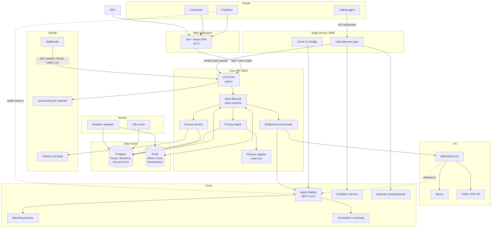
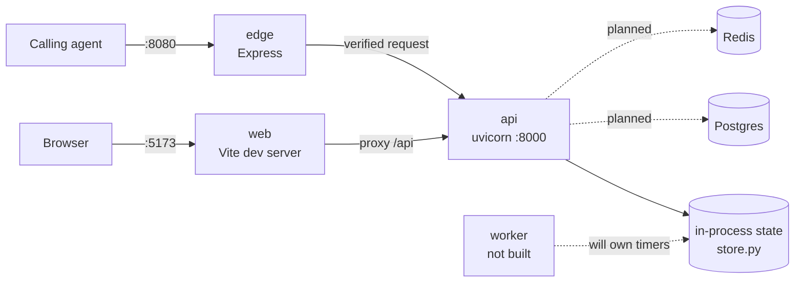
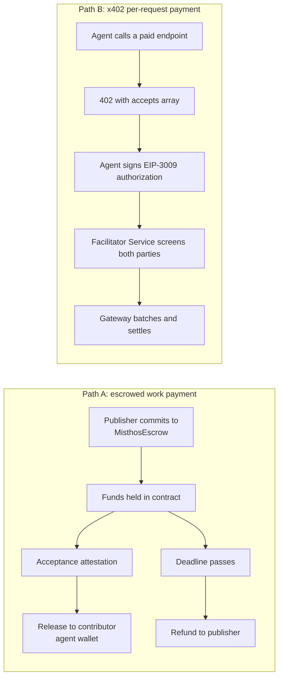
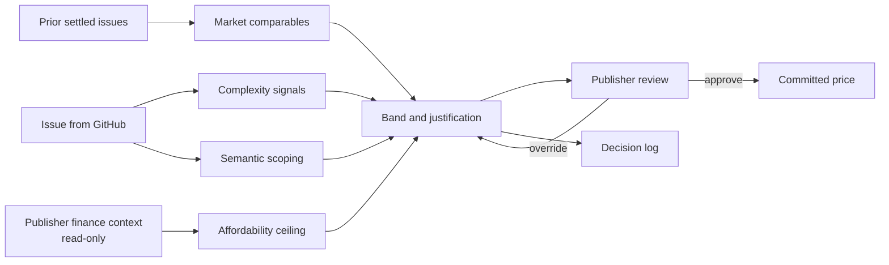
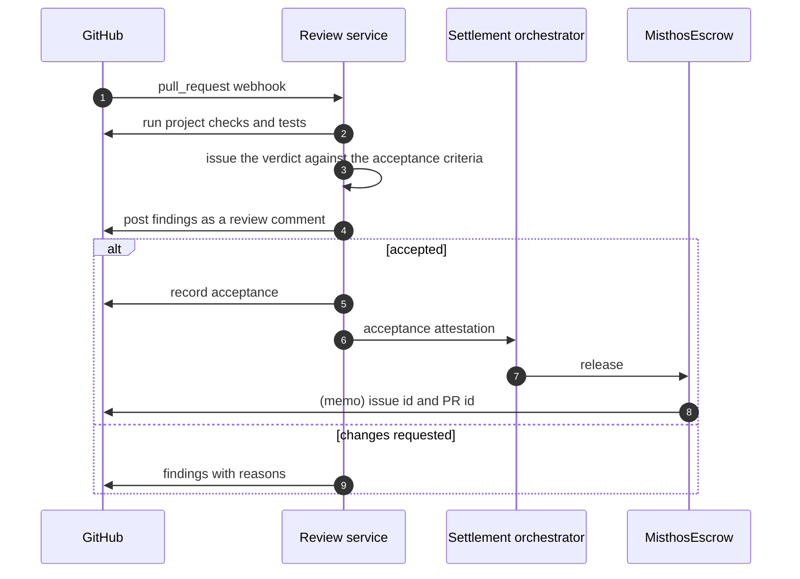
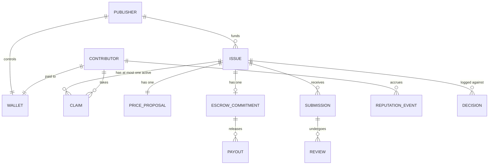
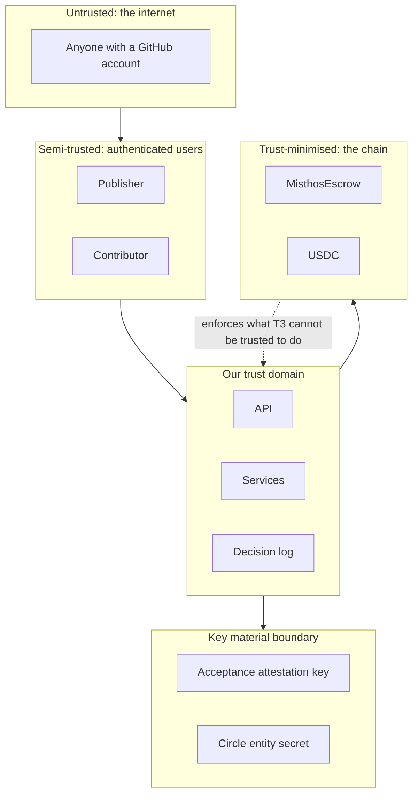

# Architecture

Technical architecture for Misthos. This is the engineering counterpart to the business documents in [docs/misthos/](./misthos/README.md).

Read [05 How it works](./misthos/05-how-it-works.md) first if you want the product in your head. This document assumes you know what the product does and focuses on how it is built, what runs where, and which decisions are load-bearing.

Technical facts about Arc and the Circle stack are sourced from [docs.arc.io](https://docs.arc.io/llms.txt) and [developers.circle.com](https://developers.circle.com/llms.txt), read on 6 October 2026.

## What exists today

The diagrams below describe the target system. This table is what is actually in the repository, so the two are not confused.

| Layer | Component | State |
| --- | --- | --- |
| Web | Vite + React SPA, generated API client | Built. Three routes, live against the API |
| Edge | Express x402 gate and Circle CLI bridge | Built. The gate settles through Circle Gateway Nanopayments when `MISTHOS_SIMULATED=false`; simulated by default |
| Core | FastAPI, lifecycle, pricing engine, decision log | Built. 48 tests |
| Worker | Job runner and deadline sweeper | Not built. The simulation has no timers |
| Contracts | `MisthosEscrow` | Built. 18 Foundry tests |
| Data | Postgres, Redis | Not built. State is in process and resets on restart |
| Integrations | GitHub App, Circle wallets, Arc settlement | Not built. Faked behind the same interfaces |

Everything marked not built has its interface in place, which is why the missing pieces are listed here as work rather than as risk.

## Design constraints

These come from the business documents and are treated as fixed. Every decision below follows from them.

| # | Constraint | Source |
| --- | --- | --- |
| C1 | The platform never holds customer funds | [08 Trust, compliance and risk](./misthos/08-trust-compliance-and-risk.md) |
| C2 | Two human checkpoints: approving the price, accepting the work | [05 How it works](./misthos/05-how-it-works.md) |
| C3 | Fixed price set before publication, no bidding, no auction, no negotiation | [06 The pricing engine](./misthos/06-pricing-engine.md) |
| C4 | GitHub is the only forge integration | [02 Problem and vision](./misthos/02-problem-and-vision.md) |
| C5 | Agent budgets enforced somewhere the agent cannot reach | [08 Trust, compliance and risk](./misthos/08-trust-compliance-and-risk.md) |
| C6 | Finance integration is read-only | [06 The pricing engine](./misthos/06-pricing-engine.md) |
| C7 | Settlement cost must stay viable for a $50 issue | [07 Business model and economics](./misthos/07-business-model-and-economics.md) |

C1 and C5 pull in opposite directions and set the shape of the whole system. C1 says the money cannot sit with us. C5 says a limit must bind an agent that we do not fully trust. The resolution is that the money sits in a contract and the limit lives in the same contract, so enforcement is a property of the chain rather than of our application code.

## System overview

Read it as four layers. The browser talks to the API only, over one origin. The edge service sits in front of anything an agent pays for, because Circle's x402 seller middleware is TypeScript-only. The core holds the domain logic and is the only thing that talks to the data stores. The worker owns anything time-based, which is most of the lifecycle: claim expiry, review deadlines, refunds on deadline.

Postgres and Redis are the intended shape rather than the current one. This build keeps state in process so it runs with no infrastructure; see [Runtime topology](#runtime-topology) for what is actually running today.

The Circle box is a platform dependency rather than a library. Three things in that box are not replaceable without rewriting the trust story: MPC wallets with the user retaining custody, the spending policies that cap an agent, and the transaction screening that runs before submission.

## Components

### Web application

| Component | Responsibility | Notes |
| --- | --- | --- |
| `frontend/` | The interface for publishers and contributors | Vite 6, React 19, TypeScript. An SPA, so no server rendering and no SEO to lose behind a login |
| Routing | `react-router-dom` | Three routes: overview, issues, issue detail |
| Server state | TanStack Query | Caching and invalidation. A lifecycle action invalidates the issue, its timeline, the list and the metrics in one go |
| API access | `openapi-typescript` plus `openapi-fetch` | The client is generated from the API's OpenAPI schema, so backend and frontend drift is a compile error rather than a runtime surprise |

The frontend holds no business rules. It renders state and calls endpoints, which keeps the money logic in one place.

### Edge service

| Component | Responsibility | Notes |
| --- | --- | --- |
| `edge/` | The x402 seller gate and the Circle CLI bridge | Express, TypeScript |
| x402 gate | Answers an unpaid request with `402` and a machine-readable `accepts` array, then settles and forwards | Circle's Gateway Nanopayments middleware ships as `@circle-fin/x402-batching`. Their own guidance for FastAPI and other non-Node APIs is a thin proxy in front, which is this process |
| Wallet bridge | Runs agent wallet operations | Agent wallets are documented around the Circle CLI, a Node package |

This process exists for exactly two reasons and both are Node-only dependencies. Anything else that lands here belongs in the core instead.

### Core API

| Component | Responsibility | Notes |
| --- | --- | --- |
| `backend/src/misthos/api/` | HTTP surface under `/api/v1` | FastAPI. Issues, proposals, lifecycle actions, metrics, decisions, webhook receiver |
| `backend/src/misthos/domain/` | Lifecycle state machine, money units, pricing engine | Deliberately IO-free, so the two places a bug costs real funds are testable without a database |
| `backend/src/misthos/store.py` | State, and the seeded simulation | In-process today. Becomes repositories over Postgres |
| Pricing engine | Produces the price band and its justification | Scores six signals, then applies market context and the publisher's affordability ceiling |
| Review service | Runs the project's checks, issues the verdict, files findings on the pull request | The verdict is the decision. Only a merge or the grace period moves money |
| Settlement orchestrator | Commits, releases, refunds, reconciles | The only component that can move money, and it moves it by calling a contract |
| Finance adapter | Reads budget and cash context, read-only | Pluggable. Firefly III first, then beancount, Odoo, ERPNext, Invoice Ninja |

The lifecycle is the single writer of issue state. Letting the pricing engine or the webhook handler write state directly is the fastest way to get an issue that is both funded and refunded.

### Worker

| Component | Responsibility | Notes |
| --- | --- | --- |
| `backend/src/misthos/workers/` | Anything time-based | Claim expiry, review deadlines, refund on deadline, reconciliation against the chain |

A job table in Postgres using `SELECT … FOR UPDATE SKIP LOCKED` is enough to several hundred issues a day and adds no infrastructure. Temporal is the correct answer once the saga complexity bites, and it is an unnecessary cluster before then.

### Data stores

| Store | Holds | Notes |
| --- | --- | --- |
| Postgres | Issues, price proposals, claims, submissions, reviews, decisions, and a local mirror of escrow state | The mirror is never the authority. Reconciliation runs against the chain and a divergence is an alert |
| Redis | Claim locks, idempotency keys, rate limits | A claim is a mutual exclusion problem, so the lock has to be somewhere atomic |
| Decision log | What the agent saw, decided and spent | Append-only and replayable. The artifact that makes delegated authority defensible |

Three rules about persistence, all of them load-bearing.

The chain is the source of truth for money. Our copy of an escrow commitment is a cache with an expiry, not a record.

Price proposals are immutable. An override creates a new proposal rather than editing one, because overrides are the most valuable training signal the pricing engine will ever get.

Reputation derives only from settled issues. Anything else rewards activity, and activity is cheap.

### On-chain contracts on Arc

| Contract | Purpose |
| --- | --- |
| `MisthosEscrow` | Holds committed USDC per issue. Releases on an acceptance attestation, refunds on deadline |
| `Memo` (predeployed) | Attaches the issue and PR reference to every money movement, so reconciliation is on-chain |
| `Multicall3From` (predeployed) | Batches payouts while preserving the original sender as `msg.sender` |

`MisthosEscrow` is the only contract we write. Its job is to make four things true:

1. Money for an issue is visibly committed before a contributor starts.
2. Release requires an acceptance attestation from a key the contributor cannot obtain.
3. Refund happens on a deadline without requiring anyone to act.
4. A per-issue ceiling is enforced here, so an agent with a compromised key cannot drain a budget.

### Circle primitives

| Primitive | Role in Misthos | Why this one |
| --- | --- | --- |
| Agent Wallets | Publisher treasury wallet, one per contributor for payout | Built on user-controlled wallets with 2-of-2 MPC. Key shares are never exposed to the agent, and the user retains custody |
| Spending policies | Caps on the agent's own wallet | Per-transaction, daily, weekly and monthly limits, plus recipient and contract allowlists |
| Facilitator Service | Settles x402 payments | Validates the signature, screens both parties, submits through a Circle relayer, and pays the settlement gas |
| Gateway Nanopayments | Rail for per-request payments | Batches thousands of payments into one onchain transaction, down to $0.000001 |
| Transaction screening | Pre-submission sanctions control | Runs inside the wallet flow, so a blocked transfer never reaches the chain |
| Smart Contract Platform | Deploy and monitor contracts | Deployment plus event monitoring, which saves building an indexer |
| CCTP | Bridge USDC for publishers holding funds elsewhere | Arc's CCTP domain is `26` |
| USYC | Yield on committed funds awaiting release | Eligible entities only. See the caveat below |

## Runtime topology

Four processes, three ports, and no infrastructure to run for the simulation.

| Process | Runtime | Port | Entry point | State |
| --- | --- | --- | --- | --- |
| `web` | Node 22, Vite | 5173 | `frontend/src/main.tsx` | Built |
| `api` | Python 3.11, uvicorn | 8000 | `backend/src/misthos/main.py` | Built |
| `edge` | Node 22, Express | 8080 | `edge/src/index.ts` | Built, rails stubbed |
| `worker` | Python 3.11 | none | `backend/src/misthos/workers/` | Not built. Needs the timers |

| Data | Where it lives today | Where it goes |
| --- | --- | --- |
| Issues, proposals, claims, submissions, reviews | In process, `store.py`, reset on restart | Postgres via repositories |
| Decision log | In process, append-only per issue | Postgres, append-only, replicated |
| Escrow state | Mirrored in process | Read from the chain on a schedule, never trusted from our own copy |
| Claim lock and idempotency keys | Not implemented | Redis |
| Contract | `contracts/`, 18 Foundry tests | Deployed to Arc testnet |

Two consequences worth being explicit about, because they are the difference between a demo and a system.

Every restart loses the simulation. That is fine for a demo and unacceptable for anything real, which is why the store is written behind a narrow surface that repositories can replace without touching the domain.

Nothing enforces the claim lock yet, because there is only one process. The moment there are two, two contributors can claim the same issue. Redis with a short TTL is the fix and it needs to land before anyone runs this behind a load balancer.

## The money model

This is the part worth reading twice, because two mechanisms exist and mixing them up will produce an incoherent design.

### Two settlement paths, not one

**Path A carries the work payment.** A publisher commits USDC into `MisthosEscrow` against a specific issue. The contract holds it. On acceptance it releases to the contributor, on deadline it refunds. This is the path that satisfies C1, because the platform is never a custodian, and C7, because an Arc transfer costs about a cent.

**Path B carries everything metered.** Paying our own review agents per invocation, a publisher buying a pricing report, or any endpoint we expose for agents to consume. No escrow, no commitment, no state. The agent pays per request and gets a result.

The reason to keep them apart is that escrow and nanopayments want different things from an account. Gateway Nanopayments and x402 batch settlement require EOA signatures and do not support ERC-1271, while escrow wants contract logic. Forcing one mechanism to do both jobs would mean either giving up programmable release or giving up batched settlement.

### Why escrow is a contract and not a balance we hold

The market research has a bankruptcy in it. Bountysource acted as trustee, stopped paying verified claims, and filed in November 2023. The design response is structural rather than procedural: do not be in a position to keep the money.

Three consequences worth stating plainly.

The platform has no ability to move escrowed funds except by producing the attestation the contract expects. That is not a policy we follow, it is a capability we lack.

A contributor can verify the commitment on-chain before writing a line of code, which removes the need to trust us.

A dispute about whether work is acceptable is still a judgement call, and a contract cannot make one. That is what the platform's review is for, and the contract only ever sees the outcome.

### USDC on Arc: the decimals trap

Arc's USDC is one pool of funds exposed through two interfaces. This is the single most likely source of a catastrophic bug in this system.

| Interface | Decimals | Used for |
| --- | --- | --- |
| Native | 18 | Gas and `msg.value` only |
| ERC-20 at `0x3600000000000000000000000000000000000000` | 6 | All balances, transfers, approvals and display |

Rules the code must follow:

- Never sum the two views. They are the same money, and adding them double-counts it.
- Never treat native to USDC as a swap. It is not a conversion, it is the same asset.
- Never call `decimals()` on a native sentinel address. It reverts.
- Keep every amount in the 6-decimal ERC-20 view except raw gas math. Name variables so the view is unambiguous.

Escrow amounts, price bands and payouts are all 6-decimal. Only gas estimation touches 18-decimal.

### Arc behaviours that affect this design

| Behaviour | Consequence for Misthos |
| --- | --- |
| Deterministic finality under one second | No confirmation polling, no reorg handling, no retry logic for a chain that changed its mind. Settlement can be treated as synchronous from the user's perspective |
| Fees denominated in USDC, EIP-1559 with EWMA smoothing | Costs stay predictable. Design target is about $0.001 per ERC-20 transfer |
| Minimum base fee 20 Gwei on testnet, ceiling 20,000 Gwei | Testnet cost control matters. Batch small payouts rather than sending each individually |
| Blocklist enforced at runtime | A transfer to or from a blocklisted address reverts, and a transaction that reverts on the blocklist check still consumes gas |
| `PREVRANDAO` always returns `0` | No onchain randomness. Do not build randomness into assignment or dispute resolution |
| Blob transactions rejected | Do not use type-3 transactions |
| Non-zero-value call to a self-destructed account reverts | Do not use `SELFDESTRUCT` anywhere in the escrow design |
| `address(0)` sends revert | Guard every recipient address before calling |

### Reconciliation

Every money movement carries a memo. The `Memo` contract wraps the call, routes it through the `CallFrom` precompile so the original wallet stays as `msg.sender`, and emits an ordered audit trail: `BeforeMemo`, the inner event, then `Memo` with the memo id and payload.

We attach the issue id and the pull request id. That means a transfer can be reconciled against a funded issue by reading the chain, without trusting our database. The decision log records the same references off-chain, so the two can be diffed, and a mismatch is an incident rather than a mystery.

For a batch of small payouts, `Multicall3From.aggregate3` sends them in one transaction while each USDC transfer still sees the originating wallet as the sender.

### On yield

Committed funds sitting in escrow for three weeks earn nothing. USYC is the obvious answer and it is available on Arc.

Two caveats keep it out of the critical path. USYC is restricted to entities that are not US Persons under Regulation S, which rules it out for some publishers and contributors. And moving funds into a yield-bearing token means the escrow no longer holds the exact asset it promised to release, which adds a redemption step between acceptance and payment.

The design position: escrow holds USDC. Yield on idle commitments is an optional module on top, and it is a later feature rather than a launch dependency.

## The pricing pipeline

The finance adapter is read-only by design. It answers two questions: what is left in the relevant budget, and what the cash position looks like. It never writes.

Firefly III is the first adapter because the hackathon brief points at it, and it comes with limits worth recording. It is a personal finance manager with no chart of accounts, its own documentation refuses programmatic write access as unreliable, and its rules engine can delete a journal. That is why the adapter interface exists rather than a Firefly integration: the first customer running Odoo should be a new adapter, not a rewrite.

The adapter falls back to a declared budget band when no finance system is connected. That fallback has to work well, because most early publishers will use it.

## The review pipeline

The review service issues the verdict and never releases money. That separation is C2, and it is also the answer to the hackathon's own framing of delegated authority: the agent can decide, but the limit sits somewhere it cannot reach.

Rework rounds are bounded. An unbounded review loop costs more than the fix is worth, which is the exact problem the product exists to solve.

Merge is acceptance. Payment is triggered by the merge event rather than by a separate click, so a publisher cannot take the patch and skip the payment.

## Data model

| Entity | Key fields | Notes |
| --- | --- | --- |
| Publisher | GitHub org or user id, wallet address, tier, budget rules | Identity is the GitHub account |
| Issue | Repo, number, acceptance criteria, state, deadline | State owned by the lifecycle service |
| PriceProposal | Band low, band high, recommended, signals, justification, confidence | Immutable once approved. An override is a new proposal |
| EscrowCommitment | Issue id, amount, chain, tx hash, deadline | Mirrors on-chain state. The chain is the source of truth |
| Claim | Contributor, issued at, expires at | At most one active claim per issue |
| Submission | PR number, head sha, checks result | Immutable per sha |
| Review | Verdict, findings, decided at | The platform's verdict is the decision. There is no draft to confirm |
| ReputationEvent | Contributor, repo, outcome, amount | Derived from settled issues only |
| Decision | Actor, inputs, rule applied, outcome, cost | Append-only. Replayable |

Design notes worth keeping:

The `PriceProposal` is immutable and an override creates a new one. Overrides are the most valuable training signal the pricing engine will ever get, and mutating them away destroys it.

The `EscrowCommitment` row is a local mirror, never the authority. Reconciliation runs against the chain, and a divergence is an alert.

Reputation derives only from settled issues. Anything else rewards activity rather than outcomes, and activity is cheap.

### Where each entity lives

| Entity | Postgres table | Notes |
| --- | --- | --- |
| Publisher | `publishers` | Keyed on the GitHub org or user id. Wallet address stored, never a key |
| Issue | `issues` | Carries the state column. Only the lifecycle service writes it |
| PriceProposal | `price_proposals` | Append-only. One row per proposal, including overrides |
| EscrowCommitment | `escrow_commitments` | A cache. Refreshed from the chain, and reconciled on a schedule |
| Claim | `claims` | Partial unique index on `(issue_id) WHERE active` enforces one active claim |
| Submission | `submissions` | Unique on `(issue_id, head_sha)` |
| Review | `reviews` | The platform's verdict with its findings. There is no draft to confirm, so the publisher's merge is the only reversal |
| Decision | `decisions` | Append-only, ordered by `created_at`. No update or delete grants |
| ReputationEvent | `reputation_events` | Derived. Rebuildable from settled issues, so it is safe to recompute |
| Payout | `payouts` | One row per release, with the transaction hash as the unique key |

| Redis key | Purpose | TTL |
| --- | --- | --- |
| `claim:{issue_id}` | Mutual exclusion so two contributors cannot claim the same issue | Claim window |
| `idem:{request_id}` | Idempotency for anything that moves money | 24 hours |
| `rl:{actor}:{window}` | Rate limiting on publish and claim | Window |
| `sweep:lock` | Single sweeper, so two workers do not double-refund | 30 seconds |

The `payouts` row is written after the chain confirms, and the transaction hash is unique. A retry that tries to write the same hash fails on the constraint rather than paying twice, which is the failure the market research warns about: an agent that retries after a timeout can pay an invoice twice and the books will still balance.

## Trust boundaries

The interesting line is between T3 and T4. Our services can produce an acceptance attestation, but only the escrow contract can act on it, and only for an issue whose funds are committed. Compromising a service gets an attacker the ability to request a release, not the ability to move a budget.

Key material rules:

- The acceptance attestation key is held in a managed secret store, never in environment files, never in the repository.
- No private key is ever passed as a command-line argument outside local testing.
- The Circle entity secret never reaches the client, and rotation has a runbook.
- Policy changes require an out-of-band confirmation. Circle's own spending policies use an email OTP for this reason, and we mirror that expectation for our own admin actions.

## Compliance

| Control | Where it runs | Why there |
| --- | --- | --- |
| Sanctions screening before submission | Circle wallet and Facilitator Service | Blocked transfers never reach the chain |
| Contributor identity verification | At first payout | Progressive. Verifying at signup is the main contributor drop-off cause |
| Publisher screening | At organisation onboarding | Before the first commitment |
| Continuous re-screening | Scheduled, plus on risk events | Point-in-time screening is the industry's mistake and the hackathon's fifth brief is about it |
| Recipient allowlist | Wallet policy, enforced on-chain | Reduces the blast radius of a compromised key |
| Blocklist awareness | Arc runtime plus our pre-checks | A blocklist revert still burns gas, so we check before sending |

Circle's Compliance Engine is the mechanism for custom rules beyond OFAC, and it is available only to eligible customers on request. Until that access is in place, the baseline is Circle's built-in OFAC handling plus our own provider-backed checks.

## Environments

| | Testnet | Mainnet |
| --- | --- | --- |
| Chain id | `5042002` (`0x4CEF52`) | `5042` (`0x13B2`) |
| RPC | `https://rpc.testnet.arc.io` | `https://rpc.mainnet.arc.io` |
| Explorer | `explorer.testnet.arc.io` | `explorer.arc.io` |
| USDC ERC-20 | `0x3600...0000`, 6 decimals | `0x3600...0000`, 6 decimals |
| EURC | `0x89B50855Aa3bE2F677cD6303Cec089B5F319D72a` | `0xbEf5f6d51CB62b58e6A8f77868681825C6fe21c1` |
| Faucet | faucet.circle.com | none, real USDC |
| CCTP domain | `26` | `26` |

Development happens on testnet. Mainnet moves real USDC irreversibly, so any mainnet path requires an explicit confirmation step in the tooling rather than a configuration flag.

Wallet addresses are identical across testnet and mainnet for USDC because it is a predeploy at a fixed address on every Arc network.

## Non-functional requirements

| Requirement | Target | Rationale |
| --- | --- | --- |
| Settlement cost per payout | Under $0.01 | C7. A $50 issue must remain viable |
| Time from acceptance to payout | Under 10 seconds | The contributor's aha moment is watching money arrive |
| Policy evaluation | Before every outbound transfer | A limit checked after the fact is not a limit |
| Price proposal latency | Under 60 seconds | Long enough for real reasoning, short enough to stay in a session |
| Review latency | Under 5 minutes | The contributor is waiting, and a slow queue is the problem we are solving |
| Ledger reconciliation | Every settlement, continuously | Divergence between chain and database is an incident |
| Decision log durability | Append-only, replicated | The record is the product's justification for autonomy |

## Cost model per issue

| Item | Estimate | Basis |
| --- | --- | --- |
| Arc transfer, commitment | ~$0.001 | Design target per ERC-20 transfer |
| Arc transfer, release | ~$0.001 | Same |
| Batched releases | Amortised, lower | `Multicall3From` |
| Review agent, ~15 minutes | ~$6 | Published per-minute agent pricing |
| Screening | Per check | Provider-dependent |
| Total | Under $7 | Dominated by model inference, not settlement |

Inference is roughly nine hundred times the settlement cost. Any optimisation effort should start there.

## Architecture decisions

| # | Decision | Rationale | Reversibility |
| --- | --- | --- | --- |
| ADR-1 | Escrow funds live in a contract on Arc, never in a platform account | Removes custody, removes the failure mode that bankrupted the previous attempt in this category | Hard. This is the trust story |
| ADR-2 | Two settlement paths: escrowed work payments, x402 for metered calls | Each mechanism is good at one job, and both are available. Forcing one to do both would cost programmable release or batched settlement | Medium |
| ADR-3 | Fixed price set before publication, no bidding | See [06 The pricing engine](./misthos/06-pricing-engine.md). A price round rewards the least careful bidder | Medium |
| ADR-4 | The review agent decides, and the publisher's merge is the only human signature on release | C2, and the hackathon's own framing of where an agent's authority must stop | Superseded: the human second opinion was a third party with a fee, and it cost more than it bought |
| ADR-5 | GitHub only | One integration done deeply beats three done shallowly. Acceptance criteria can read the project's own test suite | Medium |
| ADR-6 | Finance integration is read-only and adapter-shaped | Writing to a customer's ledger inherits liability with no product benefit. Firefly III is too narrow to be the only shape | Easy |
| ADR-7 | Identity verification at payout, not signup | Verification at signup is the largest contributor drop-off cause | Easy |
| ADR-8 | Arc is the only settlement chain | Sub-second deterministic finality and cent-level fees are the reason the product is viable at small amounts | Hard while the cost advantage holds |
| ADR-9 | Decision log is append-only | Delegated authority requires a record that can be replayed. A mutable log is not evidence | Hard |
| ADR-10 | Reputation derives only from settled issues | Rewards outcomes rather than activity | Easy |

## Open technical decisions

These are unresolved. Each one has a real constraint behind it, and none should be quietly assumed away.

**Spending policies are mainnet only.** Circle's wallet spending policies do not support testnet, and setting one triggers an email OTP. That means the agent-guardrail story cannot be demonstrated on testnet through Circle's own mechanism. Either the demo runs on mainnet with small real amounts, or `MisthosEscrow` implements the per-issue ceiling itself so the guardrail exists at both tiers. The second is more work and is the more honest design, because it puts the limit in the contract rather than in a policy tied to one vendor.

**Nanopayments require EOA signatures.** Gateway Nanopayments and x402 batch settlement do not support ERC-1271. If a contributor is paid to a smart contract account, Path B is unavailable to them. Path A is unaffected, which is another argument for keeping escrow as the primary rail.

**Testnet or mainnet for the demo.** Testnet is free and repeatable. Mainnet is what the judges weight more heavily, and it is the only place the spending-policy guardrail exists. This is a product decision as much as a technical one.

**Yield on committed funds.** USYC would make idle escrow productive, and it adds a redemption step between acceptance and payment plus an eligibility restriction on who can hold it. Worth doing after the core loop works.

**Review agent quality.** The single largest technical risk in the system. With no human reviewer behind it, an unreliable verdict is not a wasted review, it is a wrong decision about someone's money, and the maintainers whose acceptance the marketplace depends on wear the consequences. Nothing else in this document matters if this does not work.

**Chain re-org assumption.** Arc gives deterministic finality, so we assume none. If the platform ever settles on a probabilistic chain, every settlement path needs rework rather than a configuration change.

## Glossary

Technical terms only. Product and market terms are in [12 Glossary](./misthos/12-glossary.md).

| Term | Meaning |
| --- | --- |
| `CallFrom` | Arc precompile that executes a call on behalf of the original transaction sender, so a wrapper contract does not become `msg.sender` |
| CCTP | Cross-Chain Transfer Protocol. Burns USDC on one chain and mints on another. Arc's domain is `26` |
| Deterministic finality | A transaction is either unconfirmed or final, with no intermediate state and no reorg risk |
| EIP-3009 | Standard for a signed transfer authorization, which is how an agent pays without holding gas |
| Entity secret | Circle's 32-byte secret that authorizes signing for developer-controlled wallets. Circle does not store it |
| EWMA | Exponentially weighted moving average, used by Arc to smooth the base fee |
| Gateway | Circle's unified USDC balance. Nanopayments batch thousands of payments into one onchain transaction |
| Memo contract | Arc predeploy that attaches metadata to a call and emits an ordered audit trail |
| `Multicall3From` | Arc predeploy that batches calls while preserving the original sender |
| MPC 2-of-2 | Key management where two shares must co-operate to sign. Agent wallet key shares are never exposed to the agent |
| Predeploy | A contract present at a fixed address on every network of a chain, such as USDC on Arc |
| SCA | Smart contract account. Cannot be used with nanopayments, which require EOA signatures |
| System emitter | Arc address `0xffff...fFFE` that logs all native USDC transfer events |
| x402 | Open standard for paying over HTTP. A server returns `402 Payment Required` with a machine-readable price list |
