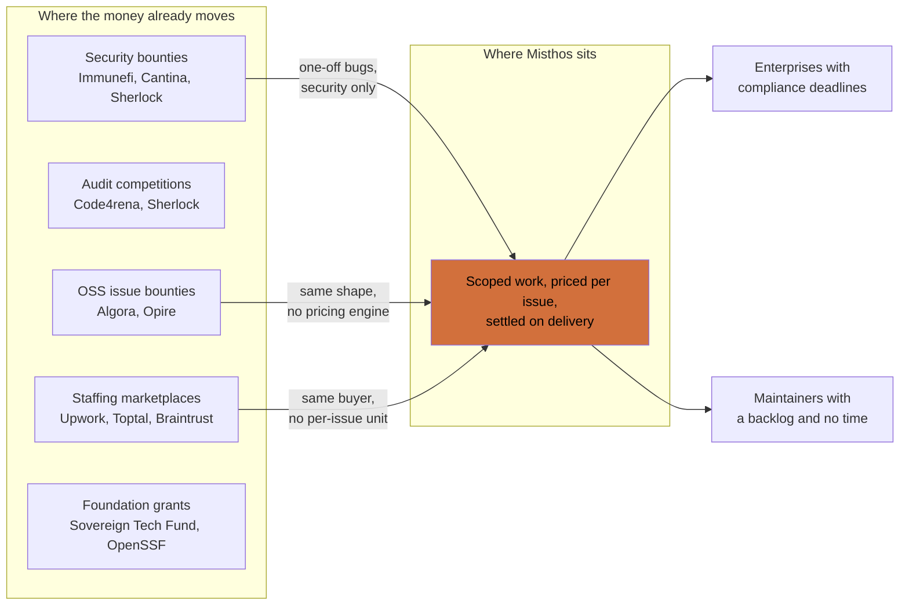

# Market research

Who else is trying this, what they charge, what happened to the ones that closed, and how big the money actually is.

Every claim below carries a label so you can tell what we checked from what we guessed.

| Label | Meaning |
| --- | --- |
| Sourced | We read it on a primary page. Link is in the sources list. |
| Observed | We looked at the live site or product on 5 October 2026 and described what was there. |
| Inferred | Our reading of the evidence. Could be wrong. |
| Unverified | We could not confirm it and it should not be used in a pitch until someone does. |

---

## 1. The competitor that matters most is doing nothing

Before any named competitor, the alternative we are replacing is a maintainer leaving an issue open for two years.

The pattern is documented well enough that it shows up in vendor marketing. Opire's own homepage runs a testimonial from a software engineer describing a discussion opened in December 2021, still unresolved in August 2024, with only workarounds to show for it. That is three years of a paid problem sitting in a public tracker, with nobody able to put money against it. (Sourced: Opire homepage.)

So we are not competing with a company. We are competing with the assumption that free labour is the only way open-source work gets done, and that paying for it is not worth the paperwork.

That assumption is softening. The rest of this document is about how much.

---

## 2. Who we compete with, on one page

The three arrows into Misthos are the three places a customer might come from. They are also the three places that could take the customer first.

---

## 3. Open-source bounty platforms

These are the closest thing to a direct competitor. Every one of them pays a contributor for a merged pull request against a public issue.

| Platform | What it does today | Who funds it | Status |
| --- | --- | --- | --- |
| Algora | Still runs bounties, now sells recruiting as the main product | Companies hiring OSS engineers | Active, repositioned |
| Opire | Anyone can attach money to any GitHub issue; backers pay their own share separately | Backers, project owners, teams | Active |
| IssueHunt | Japanese vulnerability disclosure and bug bounty programs | Companies buying security programs | Active, different business |
| Bountysource | Crowdfunding plus GitHub issue bounties, acting as trustee | Backers | Dead. Bankruptcy November 2023 |
| Gitcoin | Grants rounds, campaigns, research on capital allocation | Grant funders | Active, moved on from bounties |

### Algora

Algora was the best-funded attempt at this exact idea. Its homepage now reads "Hire the top 1% open source engineers." The bounties are still there, reachable from the navigation, with public bounties listed against projects including Turso, Golem Cloud, TSPerf and Prettier. The page sells interviews, a hiring agent, and case studies about companies that hired a contributor. (Observed: algora.io.)

Read that as a signal about where the money is in this market. Running bounties alone did not carry the company. Matching a proven contributor to a hiring manager did. (Inferred.)

That does not kill our idea. It tells us which revenue line to build first, and it tells us that a bounty platform produces something worth keeping as a byproduct: a verified record of who can actually finish work in a codebase. That record is worth more than the take rate on the bounty.

### Opire

Opire keeps the model clean. Any issue gets a bounty, multiple backers can stack onto it, and each backer pays their share when the pull request is accepted. Payouts are arranged after approval rather than held in a single pot. (Observed: opire.dev.)

Two consequences worth noting. First, nobody is a trustee, so nobody can walk off with the pot. Second, the contributor carries the risk that a backer simply does not pay, because there is no escrow. The product solves trust by removing the custodian, and pays for it with a weaker contributor guarantee.

### IssueHunt

IssueHunt now describes itself as the number one bug bounty platform in Japan and sells public and private vulnerability disclosure programs to companies. Rewards are paid by bank transfer or PayPal. Issue bounties are absent from the homepage. (Observed: issuehunt.io.)

That is a second well-known player leaving per-issue open-source bounties for enterprise security programs, where the buyer has a budget line and a compliance reason to spend. (Inferred.)

### Bountysource, and why the custodian problem is the whole problem

Bountysource is the cautionary tale. It launched in 2003, relaunched in 2012 on the GitHub API, and acted as the trustee holding the money until a maintainer merged a patch. Backers funded tasks, developers solved them, and Bountysource held the cash in the middle, drawing on PayPal and Bitcoin. It was acquired by CanYa in 2017 and by The Blockchain Group in 2020. By June 2023 it had stopped paying developers with verified claims, and the parent filed for bankruptcy in November 2023. The site has been unreachable since. (Sourced: Wikipedia, Bountysource.)

Evan Boehs documented the developer side of this: "Bountysource Stole at Least $21,000 From Open Source Developers." (Sourced via the Wikipedia article's references.)

The lesson is not that bounties are a bad idea. It is that a third party holding other people's money is a business with a licence-shaped hole in it, and the failure mode is not "the platform shuts down," it is "the platform keeps the money and there is no recourse." Every design decision about custody in this product has to answer that story.

---

## 4. Enterprise work marketplaces

These compete for the same budget as us, and they are the incumbent way a company buys contract software work.

| Platform | Shape | Take rate | Escrow |
| --- | --- | --- | --- |
| Upwork | Open marketplace, hourly and fixed price | Roughly 10% sliding with lifetime spend (Unverified for the current schedule) | Yes, milestone-based |
| Toptal | Vetted network, placed talent | Not published, priced into the client rate | Managed by contract |
| Braintrust | Talent-owned network | 10% client fee | Yes |
| Gun.io | Vetted network for funded startups | Not published | Contract-based |
| Contra | Commission-free independent work | 0% on the base product, paid tiers | No escrow |

The important difference is the unit of sale. Every one of these sells a relationship or a person. Neither of them sells a specific piece of work against a specific issue in a specific repository at a specific price.

That gap is our opening. It is also why these platforms have no reason to care about us yet: a $2,000 bug fix is below the threshold where a staffing marketplace is willing to run a sales process. (Inferred.)

---

## 5. Security bounties are the useful proof of willingness to pay

Security is where paying per fixed task is already normal, and the numbers are large enough to show that companies will spend real money on scoped work delivered by strangers.

| Evidence | Number | Source |
| --- | --- | --- |
| Code4rena closed after five years | 512 audits completed, 1,607 unique high-severity vulnerabilities found, 16,600+ registered wardens | Observed: code4rena.com |
| A single Code4rena engagement | $40,000 in USDC for one audit competition | Observed: code4rena.com |
| Another engagement | $22,000 in USDC | Observed: code4rena.com |
| Immunefi | Runs bug bounty programs, PR reviews, audits and audit competitions as separate products | Observed: immunefi.com |

Two things follow.

Paying a stranger per verified deliverable is a solved commercial behaviour, and the amounts are not small. A $40,000 pool for one engagement is far above what an OSS bug fix trades for today.

And Code4rena closing is another warning. It reached 16,600 registered wardens across five years and still could not sustain the business. Contest-based security work has a structural problem we should study: each engagement requires the buyer to run a procurement cycle, and the supply of wardens is seasonal. (Inferred.)

---

## 6. Onchain escrow, milestones and streaming

This group supplies the plumbing rather than the customers. Two of them matter directly for the hackathon because Arc ships a reference implementation of exactly this shape.

| Project | What it provides | Relevance |
| --- | --- | --- |
| Sablier | Continuous token streaming, vesting | Paying a maintainer over a long maintenance commitment |
| Superfluid | Streaming money, subscriptions | Recurring retainer for a maintainer |
| Request Network | Payment requests and invoicing | Formal, auditable requests for payment |
| Safe Allowance Module, Zodiac Roles | Spending limits enforced by smart contract | Making an agent's budget a rule rather than a prompt |
| `circlefin/arc-escrow` | Escrow with AI-validated deliverables and release-or-refund | The reference implementation the hackathon points RFB 3 at |

`arc-escrow` is the one to study before writing a line of code. The hackathon explicitly recommends it as a starting point for the milestone brief, and it already encodes the shape we want: money goes in, a verdict on the deliverable comes out, and the contract either releases or refunds.

---

## 7. Agent payment rails

This is the rail we are building on, so the question is whether it exists at a scale that a business can rely on.

| Rail | State | Evidence |
| --- | --- | --- |
| x402 | Open standard, now under the Linux Foundation as an LF Projects series | Sourced: x402.org |
| x402 network activity | 75.41M transactions and $24.24M of volume in the last 30 days, across 94.06K buyers and 22K sellers | Observed: x402.org counters, 5 October 2026 |
| Circle Agent Marketplace | 600+ live x402 services across 15+ blockchain networks, each seller's payout wallet continuously sanctions-screened | Sourced: Circle developer docs |
| Circle Gateway Nanopayments | Gas-free USDC payments down to $0.000001 | Sourced: Circle developer docs |
| Circle Agent Wallets | Agent wallets with custom spending policies and compliance controls, gasless across chains | Sourced: Circle developer docs |
| Arc | Mainnet live, EVM compatible, stablecoin-native fees, sub-second deterministic finality | Sourced: Arc docs |
| Stablecoin volume overall | $46T total transaction volume over the last year, $9T adjusted, supply over $300B | Sourced: a16z State of Crypto 2025 |

Two readings of the x402 numbers.

The rail is real. $24M a month in a protocol that shipped in 2025 is not a rounding error, and 22,000 sellers means there is a live supply side rather than a demo.

The rail is small relative to the money a business actually moves. Scale that $24M monthly figure to a year and it is roughly $290M, against $9T of adjusted stablecoin volume. x402 handles about three thousandths of a percent of stablecoin flows today. That is the headroom, and it is also a warning that "settled by x402" is not on its own a reason for a finance department to sign. (Inferred.)

The Circle Agent Marketplace detail matters more than the headline numbers for our compliance story. Circle continuously screens every seller's payout wallet for sanctions and drops blocked sellers from the catalogue. That is a control we can inherit instead of building. (Sourced.)

---

## 8. The machines doing and reviewing the work

If agents are going to do the work, we need to know what the current price of agent labour is.

| Player | Product | Price signal |
| --- | --- | --- |
| CodeRabbit | AI code review on pull requests | $30 per developer per month, $60 for the higher tier |
| CodeRabbit Agent | Cloud coding tasks, Slack, automations | $0.40 per agent minute, after free minutes |
| Devin, Codex, Jules, OpenHands | Autonomous software engineering agents | Pricing varies, mostly per seat or per credit (Unverified) |
| Greptile, Qodo, Graphite Diamond | AI review and code quality on pull requests | Comparable per-seat range (Unverified) |

The $0.40 per agent minute figure is the most useful number on this page. It gives us a way to reason about the cost floor of automated review. A fifteen-minute agent review costs about $6. That is small enough that we can afford to run review on every submission, and large enough that it is a real line in the unit economics.

AI review is also the part of the market that is already sold per pull request rather than per relationship. The commercial shape we want already exists one layer below us. (Inferred.)

---

## 9. Market size

### How we are framing it

Platform revenue is a take rate on matched work, so the number that matters first is the volume of work that changes hands, not our revenue.

We size three layers:

- TAM: all spend on paid software maintenance, remediation and feature work that could be priced per issue.
- SAM: the slice where the buyer already uses GitHub, the work is scoped to a single issue, and the value of the task justifies a settlement on a payment rail.
- SOM: what we can realistically reach in the first 24 months with a two-sided supply problem.

### What we could verify, and what we could not

| Figure | Value | Status |
| --- | --- | --- |
| Adjusted stablecoin transaction volume, trailing 12 months | $9T | Sourced, a16z State of Crypto 2025 |
| Total stablecoin transaction volume, trailing 12 months | $46T | Sourced, same |
| Stablecoin supply | Over $300B | Sourced, same |
| x402 monthly volume | $24.24M | Observed, 5 October 2026 |
| x402 monthly transactions | 75.41M | Observed, 5 October 2026 |
| x402 monthly buyers and sellers | 94.06K buyers, 22K sellers | Observed, 5 October 2026 |
| Live x402 services in Circle's catalogue | 600+ across 15+ networks | Sourced, Circle developer docs |
| Annual spend on outsourced software maintenance, worldwide | Not verified | We could not find a primary figure we trust. Do not put a number in a deck without flagging it. |
| Freelance platform market size | Commonly cited in the single-digit billions | Unverified. Aggregator sites publishing it blocked automated access on the day we checked. |
| Open-source bounty market size | Not published by anyone we found | Unverified. Every platform in this space keeps volume private. |

That last row is the honest answer for our own category. Algora, Opire and their predecessors have never published the total value of bounties paid. Anyone quoting a bounty market size is estimating. (Inferred.)

### A bottom-up model we can actually argue about

Because the top-down sources are thin, build the estimate from units. This is a spreadsheet, not a forecast. Change any cell and the answer moves.

| Input | Low | Base | High | Basis |
| --- | --- | --- | --- | --- |
| Organisations that pay for software work and depend on third-party OSS | 200,000 | 600,000 | 1,500,000 | Estimate. Anchor: GitHub's own reporting on how many organisations depend on open source. |
| Share willing to buy work per issue rather than per person | 2% | 5% | 12% | Estimate. Compare with how many companies already fund security bounties. |
| Average annual spend through the platform, per buying organisation | $5,000 | $20,000 | $60,000 | Estimate. A mid-sized team funding a handful of fixes at $500 to $10,000 each. |
| Implied annual matched volume (GMV) | $20M | $600M | $10.8B | Calculated |
| Take rate | 8% | 12% | 15% | Design choice, see the pricing document |
| Implied platform revenue | $1.6M | $72M | $1.6B | Calculated |

Our working position is the base case, and even the base case should be treated as a ceiling rather than a plan. It assumes a market that does not exist yet, with a supply side we have to build from nothing. (Inferred.)

### What would move the number most

The single largest unknown is the willingness to buy line. If enterprises treat OSS fixes as unbudgeted charity work, the model collapses regardless of the other inputs. That is the assumption to test first, not the pricing engine.

---

## 10. Demand drivers

### Regulation is turning maintenance from optional into mandatory

The EU Cyber Resilience Act entered into force on 10 December 2024. Reporting obligations apply from 11 September 2026, and the main obligations apply from 11 December 2027. The Commission published practical guidance for manufacturers, developers and businesses of all sizes on 27 July 2026. (Sourced: European Commission, Cyber Resilience Act.)

The Linux Foundation's own explainer on the CRA is blunt about who is caught:

- An individual open-source developer is probably excluded, unless they regularly charge for work or take recurring donations from commercial entities, in which case they are likely covered.
- A nonprofit foundation developing open source will likely need to comply.
- A private company that develops, commercialises or supports open-source software is very likely covered.

That last one is our buyer. (Sourced: Linux Foundation. Caveat: the explainer is based on a draft of the Act from 2022 and predates the final text.)

Concretely, an enterprise that ships a product containing open source, and supports it commercially, now has a deadline to prove it maintains that code and handles vulnerabilities in it. That obligation has a budget attached, and the cheapest way to discharge it is to fund the maintainers whose code you ship. (Inferred.)

This is the strongest structural tailwind in the thesis. It converts a nice-to-have into a filing requirement.

### The rail got cheap enough for small payments

Arc settles in under 500 milliseconds with fees around one cent, paid in USDC rather than a volatile gas token. Circle's Gateway nanopayments go down to a millionth of a dollar. (Sourced: Circle and Arc documentation.)

Paying a maintainer $20 used to be economically silly. At a cent a transaction, it is not. That change is recent enough that no incumbent has rebuilt their product around it. (Inferred.)

### The supply of agent labour arrived

The 2025 Octoverse data covers 986 million code pushes, and GitHub's own framing is that AI is rewiring how developers choose tools. (Sourced: GitHub blog.) Whatever the exact productivity delta, the cost of producing a candidate fix has fallen far enough that reviewing submissions becomes the bottleneck rather than writing them. That reframes the value of the platform. We are not a labour market for scarce hands. We are a triage and settlement layer for abundant submissions. (Inferred.)

---

## 11. The graveyard, and what killed each one

| Failure | Cause | What we do differently |
| --- | --- | --- |
| Bountysource | Custodian held the money, stopped paying verified claims, bankruptcy in November 2023 | Do not be the trustee. Escrow in a contract, or no escrow at all. |
| Code4rena | Wound down after five years in 2025-2026 despite 16,600 registered wardens and 512 audits | Do not require a procurement cycle per engagement. Make the unit small enough to buy without a meeting. |
| Gitcoin and bounties | Moved to grants rounds and capital-allocation research | Watch for the same drift. Grants have sponsors and no verification problem. Bounties have a verification problem we are claiming to solve. |
| Maintainer resistance | Unwanted pull requests, review burden, low-quality drive-by work | Price the review. If review is unpaid and mandatory, maintainers will route around the platform. |

The maintainer resistance point deserves more weight than it usually gets. The commonly reported complaint is not that maintainers dislike money. It is that a funded issue attracts submissions from people with no context in the codebase, and the maintainer pays for that in review time. Any product that increases the review queue without compensating review will be rejected by the exact people it needs to sign up. (Inferred from the public commentary on bounty platforms, which is consistent across Algora's and Opire's own community pages.)

This is why review compensation is a feature and not a nicety.

---

## 12. Where Misthos sits

The gap, stated plainly: nobody today prices a single GitHub issue from the buyer's actual financial position, and nobody settles the payment at the moment of acceptance on a rail cheap enough to make small jobs viable.

| Capability | Algora | Opire | Upwork | Security bounties | Misthos |
| --- | --- | --- | --- | --- | --- |
| Unit of sale is a single issue | Yes | Yes | No | No | Yes |
| Assigns work by competitive bidding | No | No | Yes | No | No |
| Buyer is an enterprise with a budget | Partly | No | Yes | Yes | Yes |
| Price suggested by a valuation engine | No | No | No | No | Yes |
| Price informed by the buyer's own books | No | No | No | No | Yes, by design |
| Escrow with programmatic release | No | No | Yes | Yes | Yes |
| Settlement cost suited to sub-$50 tasks | No | No | No | No | Yes |
| Automated review as a first-class step | No | No | No | Partly | Yes |
| Pays for review work itself | No | No | No | Yes | Planned |
| Verified contributor track record | Yes | Partly | Yes | Yes | Yes |

And the honest counterweight. Algora already has the contributor network, the GitHub integration and the enterprise conversations. If it decided tomorrow that per-issue settlement on Arc was the future, it would be starting from a stronger position than ours. Our defence is that the gap is not in the marketplace, it is in the two things Algora has never needed to build: a pricing engine that reads a company's books, and settlement at a price point that makes a $40 fix worth doing. (Inferred.)

---

## 13. What this research says about the product

1. The rail is real and the work market on top of it is not built. That combination is rare and it is the reason to attempt this now.
2. Custody is the failure mode that killed the last company in this exact category. Escrow design is a trust product, not an engineering detail.
3. The two best-funded attempts both migrated toward selling something other than bounties, one into recruiting, one into security programmes. Bounty take rate alone has not yet been shown to sustain a company.
4. Enterprise security spending already proves that companies pay per verified deliverable. The OSS maintenance equivalent has no comparable buyer habit yet.
5. The EU Cyber Resilience Act gives that habit a deadline. 11 December 2027 is when the main obligations land, and the buyer profile it captures is a private company commercially supporting open-source software.
6. Maintaining a review queue is the cost that maintainers actually complain about. If the platform does not pay for review, it will not get adoption from the people whose repositories make it work.
7. x402 is roughly three thousandths of a percent of stablecoin volume today. Treat "settled on x402" as a differentiator for builders and a compliance story for buyers, not as a demand driver.
8. The largest unverified assumption is that a mid-sized company will buy a $500 fix on a payment rail it has never heard of, instead of asking an employee to do it. Everything else in the model is downstream of that.

---

## 14. Sources

Primary pages read on 5 October 2026.

| Source | URL |
| --- | --- |
| Tameion Agents Hackathon | https://tameion.thecanteenapp.com/ |
| Algora | https://algora.io/ |
| Opire | https://opire.dev/ |
| IssueHunt | https://issuehunt.io/ |
| Code4rena | https://code4rena.com/ |
| Immunefi | https://immunefi.com/ |
| Gitcoin | https://www.gitcoin.co/ |
| Bountysource history | https://en.wikipedia.org/wiki/Bountysource |
| Open-source bounty background | https://en.wikipedia.org/wiki/Open-source_bounty |
| x402 standard and live counters | https://www.x402.org/ |
| Circle Agent Stack | https://developers.circle.com/agent-stack |
| Circle Agent Marketplace and x402 handshake | https://developers.circle.com/agent-stack/agent-marketplace |
| Arc developer documentation | https://docs.arc.network/ |
| a16z State of Crypto 2025 | https://a16zcrypto.com/posts/article/state-of-crypto-report-2025/ |
| European Commission, Cyber Resilience Act | https://digital-strategy.ec.europa.eu/en/policies/cyber-resilience-act |
| Linux Foundation, CRA and open source | https://www.linuxfoundation.org/blog/understanding-the-cyber-resilience-act |
| Sonatype, State of the Software Supply Chain | https://www.sonatype.com/state-of-the-software-supply-chain/introduction |
| CodeRabbit pricing | https://www.coderabbit.ai/pricing |
| Canteen, Agents and Ledgers in 2026 | https://thecanteenapp.com/analysis/2026/09/12/agents-and-ledgers.html |
| Log4Shell | https://en.wikipedia.org/wiki/Log4Shell |
| GitHub blog and Octoverse | https://github.blog/news-insights/octoverse/ |

### Sources we tried and could not use

| Source | Reason |
| --- | --- |
| Grand View Research, freelance platforms market | Blocked automated access, HTTP 403 |
| Mordor Intelligence, freelance platforms market | Blocked automated access, HTTP 403 |
| Fortune Business Insights, freelance platforms market | Blocked automated access, HTTP 403 |
| Firefly III documentation | Blocked automated access, HTTP 403 |
| Circle's marketing pages for Arc | HTTP 404 on the paths we tried. Use docs.arc.network instead. |
| Sonatype report figures | The report renders its headline numbers in client-side counters, so no figure could be read reliably |

If someone on the team has access to any of these, the market sizing gets materially better.
