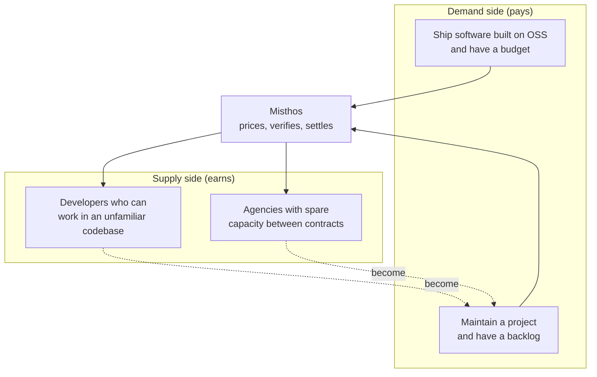
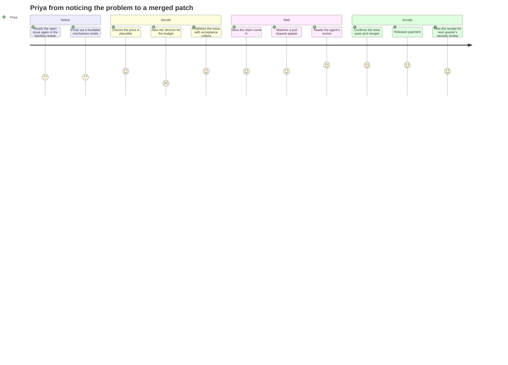

# Customers and personas

## A note on where these come from

We have had one design partner conversation and no formal interviews. The personas below are built from secondary research: the pain points the existing platforms' own communities describe, the buyer profiles that security bounty vendors sell to, and the regulatory text that creates obligations. They are working hypotheses with names attached so the team can argue about them, not findings.

Treat every "quote" in this document as a paraphrase of a public complaint, not as something a named person said to us.

The three things we still need from real interviews:

1. Whether an engineering manager has ever asked for budget to fix a dependency, and what happened.
2. What a maintainer actually considers a fair payment for an hour of review time.
3. Whether a finance or legal function has to approve a $500 payment to an unknown contractor, and how long that takes.

## The two sides of the market

That dotted line is the thing most marketplaces get wrong here. A good contributor is a maintainer somewhere else, and a maintainer is usually a contributor somewhere else. The two sides are the same population in different moods, which changes onboarding: we should not build a separate contributor funnel.

## The four personas

### Persona 1. Priya, the engineering manager who has to get it fixed

| | |
| --- | --- |
| Age | 34 |
| Role | Engineering manager, platform team |
| Company | 300-person B2B SaaS, Series C, ships a product with heavy open-source dependency |
| Technical depth | High. Reads diffs, reviews her team's pull requests. |
| Relationship to the platform | Buyer. Approves the price, accepts the work. |
| Frequency | Two or three times a quarter |

Primary job to be done: close a specific defect in a dependency without turning it into a project.

Top three pain points:

1. The workaround has become load-bearing and nobody owns removing it.
2. There is no budget line for this. Getting $500 approved for an outside contractor takes longer than the fix.
3. She cannot tell whether an unknown contributor is competent before letting them near a dependency the product ships.

Top three desired gains:

1. A price she can put in front of her director without a business case.
2. Evidence that the change is safe before she merges it. Tests passing, an agent's written review, and a scoped diff.
3. A receipt. Something she can show the security review that says this dependency gap was closed on a date.

Unexpected insight: she cares more about the diff being small and reviewable than about it being cheap. A $2,000 fix she can approve in five minutes beats a $200 fix that requires her to read 600 lines. Pricing that optimises for cheapness is optimising for the wrong thing.

Product fit: strong. She is the persona the whole flow is shaped around, and the acceptance criteria plus automated review exist specifically for her third pain point. Friction: she will need her finance team to release funds, so the payment flow has to produce something her finance team accepts as an invoice.

### Persona 2. Jonas, the maintainer with a backlog and a day job

| | |
| --- | --- |
| Age | 41 |
| Role | Senior engineer by day, maintainer of two libraries with a combined 900,000 monthly downloads |
| Company | Employed full time, maintains in evenings |
| Technical depth | Very high, and deeply familiar with his own codebase |
| Relationship to the platform | Publisher. Puts a price on his own backlog, then merges what passes review. |
| Frequency | Continuous, low intensity |

Primary job to be done: reduce his backlog without creating a second job reviewing other people's patches.

Top three pain points:

1. Funded issues attract submissions from people who have not read the codebase, and he has always been the one paying for that in review time.
2. He has been burned on money before. Bountysource held developer funds and stopped paying verified claims before filing for bankruptcy in 2023.
3. Every platform wants him to adopt its workflow rather than working where he already works.

Top three desired gains:

1. A queue he does not have to read. The platform reviews the patch, so his work is deciding whether to merge.
2. Certainty about payment. Money visibly committed before he spends an evening on anything.
3. Control. He decides what gets funded and what acceptance means, and a contributor cannot merge around him.

Unexpected insight: he does not want to be paid for review, he wants to stop doing it. A platform that pays him a review fee is still asking for his evening. A platform that reviews the patch itself is giving the evening back. That is harder to build and a far stronger reason to adopt.

Product fit: strong, and load-bearing. If Jonas does not adopt, there is no supply of well-scoped issues. Friction: our agent's first-pass review has to be good enough that he is reading a pre-filtered queue rather than a raw one. If it sends him the same quality of submission he already gets, we have made his problem worse.

### Persona 3. Amara, the developer who wants a task rather than a client

| | |
| --- | --- |
| Age | 27 |
| Role | Independent developer, previously backend engineer at a fintech |
| Situation | Between contracts, three to four months of runway |
| Technical depth | High. Comfortable in several languages, new to most specific codebases. |
| Relationship to the platform | Contributor. Earns. |
| Frequency | Several issues a month |

Primary job to be done: turn focused work into money without acquiring a client.

Top three pain points:

1. Freelance platforms want a relationship. Calls, proposals, unpaid discovery, then a contract.
2. Payment terms. Net-30 and Net-45 mean she funds her own work.
3. Uncertainty about whether the buyer will ever accept. Getting a first pull request rejected by a maintainer she has never met is expensive when there is no escrow.

Top three desired gains:

1. A price and an acceptance test, known before she starts.
2. Payment on acceptance rather than on an invoice cycle.
3. A record of her completed work that a future client or employer can verify.

Unexpected insight: she will take a lower price for a clearer acceptance test. Certainty is worth more than margin to someone with three months of runway. This supports publishing the acceptance criteria prominently rather than burying them in the issue body.

Product fit: strong. Friction: KYC is the enemy of the first session. If a contributor cannot see a price and start working before completing identity verification, most will leave. Verification has to happen at the point of payout, not the point of signup.

### Persona 4. Dev, the person whose job is the open-source programme

| | |
| --- | --- |
| Age | 38 |
| Role | Open-source programme lead or security engineering manager |
| Company | 4,000-person enterprise with a Cyber Resilience Act obligation on the 2027 calendar |
| Technical depth | Medium. Understands the problem, delegates the detail. |
| Relationship to the platform | Budget holder, not a daily user |
| Frequency | Continuous oversight, quarterly reporting |

Primary job to be done: produce evidence that the open-source components the company ships are maintained and their vulnerabilities handled.

Top three pain points:

1. The obligation lands in 2027 and the internal process to meet it does not exist.
2. Dependency scanning tells him what is vulnerable. It does not fix anything.
3. The engineers who could fix things are on product roadmaps, not on this.

Top three desired gains:

1. A spend number he can defend in a budget review.
2. Reporting he can hand to an auditor without rebuilding it in a spreadsheet.
3. Evidence of remediation over time, not a snapshot.

Unexpected insight: he does not want to be the buyer of individual fixes, and putting him in that role would slow the whole product down. He wants to fund a pool, set rules, and receive reports. His buying decision is a policy decision, which is why organisation-level seats and budget rules are our second revenue line rather than an afterthought.

Product fit: strong and differentiated. This is the persona no competitor serves, because no competitor has connected paid work to compliance reporting. Friction: he buys on a procurement cycle measured in quarters, while the rest of the product is designed for a ten-minute decision.

## Personas we are not building for

| Who | Why not |
| --- | --- |
| Non-technical founders wanting a website built | Not a scoped issue in a repository we can verify |
| Security researchers reporting vulnerabilities | Disclosure is a different process with a different legal shape |
| Enterprise procurement teams wanting vendor onboarding | Our unit is too small for their process, and they will not clear an unknown contractor for $500 |
| Companies wanting a full project delivered end to end | That is an agency engagement, not a per-issue contract |

## Journey, demand side: Priya funds a fix

| Stage | Touchpoint | Action | Feeling | Pain point | Opportunity |
| --- | --- | --- | --- | --- | --- |
| Awareness | Someone's newsletter, a colleague, the repository itself | Learns a price can be attached to an issue | Curious, sceptical | "Another platform I have to sign up for" | Put the price on the issue in GitHub. Let the publisher's GitHub identity be the account. |
| Consideration | Pricing engine output | Reads the proposed price band and reasoning | Relieved or suspicious | "Where did this number come from?" | Show the reasoning, the comparable issues, and the confidence. Open the model. |
| Approval | Internal budget conversation | Requests $500 | Resigned, expecting friction | No budget line exists for this | Produce a one-page justification the manager can forward, generated with the quote. |
| Publishing | Platform UI, human approval | Approves the price and the acceptance criteria | Focused | Writing acceptance criteria is work | Draft the criteria from the issue and the test suite. Human edits rather than writes. |
| Waiting | GitHub notifications | Watches for a claim and a pull request | Impatient | No idea whether anyone will pick it up | Deadline with automatic escalation, and a refund path if nothing arrives. |
| Review | Agent review | Reads the verdict, the test results and the diff scope | Cautious | Trusting an unknown author | Show what the agent checked. The diff stays available, but reading it is not her job. |
| Acceptance | Merge | Merges and accepts | Satisfied | Handing off payment to finance | A receipt generated at merge that finance accepts without a conversation. |

### The aha moment

The agent review arriving before she has looked at the pull request. That is the moment the product stops being a payments layer and starts being useful. If the review is not good, everything downstream is administration.

### Where she churns

If nobody claims the issue within the deadline on her first attempt. A buyer who funds an issue and gets nothing does not come back, and a refund does not repair the impression. Supply liquidity at launch matters more than anything on the buyer's side.

## Journey, supply side: Amara earns

| Stage | Touchpoint | Action | Feeling | Pain point | Opportunity |
| --- | --- | --- | --- | --- | --- |
| Discovery | Funded issues feed | Browses by language, price and difficulty | Opportunistic | "Can I actually do this?" | Show the repository, the test suite and the time estimate up front |
| Scoping | Issue page | Reads the acceptance criteria and the price | Deciding | Risk of doing work that is rejected | Publish the acceptance criteria and the review rubric before she starts |
| Claiming | Platform | Claims the issue | Committed | Losing the claim to someone faster | Time-boxed exclusive claim with an auto-release |
| Working | Their own editor | Writes the patch | Absorbed | Context cost in an unfamiliar codebase | Point the agent at the relevant files and prior related pull requests |
| Submitting | GitHub | Opens the pull request | Nervous | The review may reject on style, not substance | Run the linters and tests locally before submission so style is not the reason |
| Review | Agent review | Reads the automated findings and responds | Frustrated or vindicated | Feedback loops cost time | Keep the loop tight. Findings within minutes, not days. |
| Payment | Wallet | Receives USDC on acceptance | Relieved | KYC and payout friction | Verify at payout, not at signup. Pay out in the same session as acceptance. |
| Repeat | Issue feed | Looks for the next one | Loyal | None | Track record and a reputation score that makes the next claim easier |

### The aha moment

Payment landing in her wallet within a minute of the merge. That is the story she tells, and it is the cheapest marketing we will ever get.

### Where she churns

Identity verification at signup, or a rejection she does not understand. Both are fixable and both are common mistakes in this category.

## What the personas change about the product

1. Price the review as well as the fix. Jonas will not participate otherwise, and the whole supply of well-scoped issues depends on him.
2. Optimise for a reviewable diff rather than a cheap one. Priya's constraint is her own attention, not the budget.
3. Draft the acceptance criteria instead of asking the buyer to write them. It is the highest-friction step in publishing.
4. Verify at payout, never at signup. Amara leaves otherwise, and the first session is the whole funnel.
5. Treat Dev as a policy buyer, not a transaction buyer. Build organisation seats and reporting for him; build the per-issue flow for Priya.
6. Launch with supply, not demand. A funded issue nobody claims is worse than an issue nobody funded.
