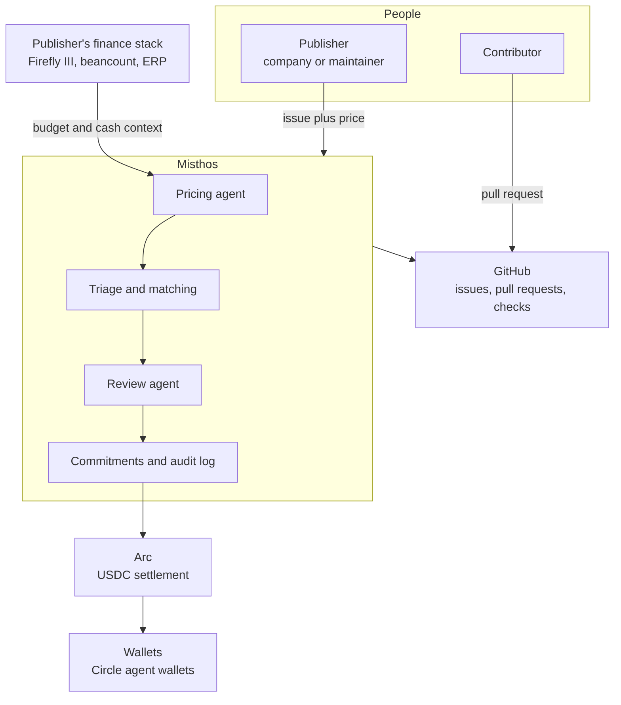
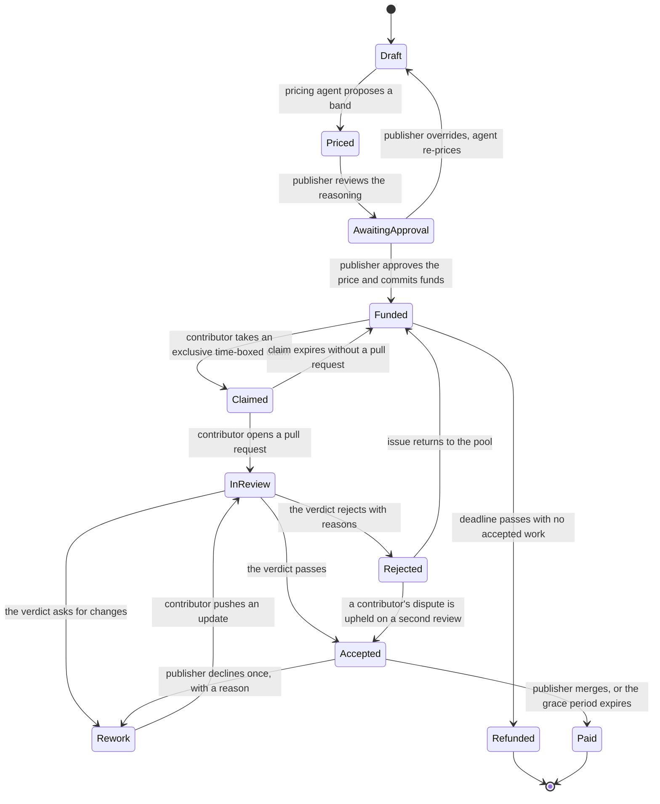
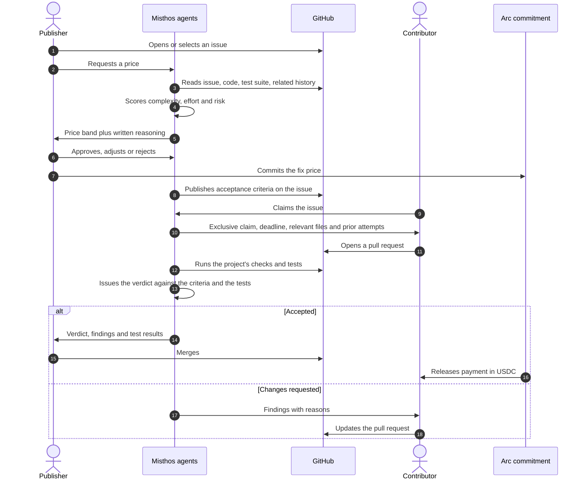
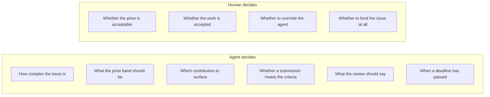
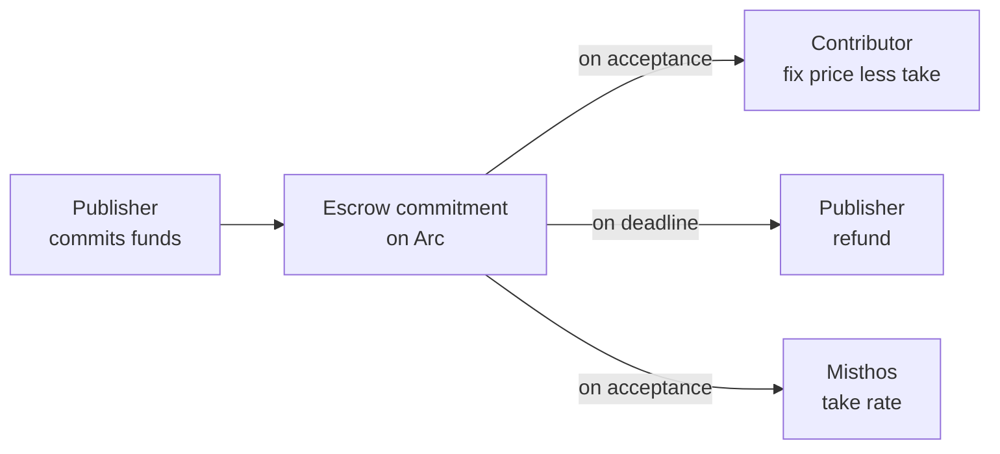

# How it works

This is the document to read if you want the product in your head in ten minutes. Everything here is at the level of who decides what and what the money does. Implementation detail is deliberately absent.

## The cast

| Actor | What they do | What they never do |
| --- | --- | --- |
| Publisher | Puts a price on an issue, approves it, merges the work | Review code line by line; the platform does that |
| Contributor | Claims an issue, writes the patch, responds to review | Merge their own work |
| Pricing agent | Reads the issue and the publisher's financial context, proposes a price, writes the reason | Move money |
| Review agent | Reads the submission against the acceptance criteria and the test suite, issues the verdict | Merge, or release payment |
| Settlement layer | Holds committed funds, releases on acceptance, refunds on timeout | Decide anything |
| Publisher's finance tool | Supplies budget and cash context to the pricing agent | Anything, unless the publisher enables it |

Review means one thing here: the platform assessing the contributor's submitted pull request against the published acceptance criteria and the project's own test suite, and issuing a verdict. It is review of the submission, not of the issue before it is funded and not of the repository in general. No human reads the diff as a required step.

## System context

The finance stack box is optional and is the part we are least certain about. Everything else works with nothing but a GitHub account and a wallet.

## The lifecycle of a funded issue

Two states carry most of the design weight. `AwaitingApproval` is the human checkpoint that keeps the agent honest about price. `Accepted` is the window in which the publisher decides whether to merge, or to decline once with a reason, and it is the only other place a person reaches into the flow. Everything between them runs without one.

## How work is assigned

One mechanism, used for every issue: **fixed price, first claim.**

The publisher approves a single number and commits the funds. The first contributor to claim the issue holds it exclusively for a bounded window, and loses it if no pull request appears. Contributors do not compete on price, because the price is already published. They compete on being ready to start.

There is no bidding round, no auction, and no negotiation. A price that could move after publication would defeat both checkpoints above: the publisher would be approving a number it might not pay, and the contributor would not know what the work is worth until someone else decided. The trade-off is that a fixed price cannot adapt to a surprise in the codebase, which is the main reason requirement clarity is scored when the price is set.

The full reasoning is in [06 The pricing engine](./06-pricing-engine.md).

## The happy path, step by step

Note the ordering around acceptance. The agent issues the verdict and Priya merges. Neither the agent nor the contributor can release money, and the release needs a verdict on record. The one exception is a publisher who goes quiet for seven days after a passing verdict, which releases anyway rather than strand finished work.

## Who decides what

The line is drawn at consequence, not at capability. An agent that gets the price wrong costs the publisher money, so a person signs it. An agent that gets the review wrong lets a bad patch into a dependency, so a person signs that too. Everything reversible belongs to the agent.

## What the pricing agent actually looks at

Full detail is in [06 The pricing engine](./06-pricing-engine.md). The short version is three inputs.

| Input | What it tells us | Where it comes from |
| --- | --- | --- |
| Task complexity | How much work this is | The issue, the repository, the number of files implicated, whether tests exist, how many prior attempts failed |
| Market context | What comparable work has recently paid | Settled issues on the platform with similar shape |
| Publisher's financial position | What this publisher should be willing to pay, and when | Budget data from the publisher's finance stack, or a declared budget band if they have not connected one |

The third input is where the product gets unusual. A maintainer with no budget and an enterprise with a compliance deadline should not see the same price for the same issue. The engine proposes different bands and the reason is visible to the buyer.

## The checkpoints, and why each one exists

| Checkpoint | Who holds it | Why it is not automated |
| --- | --- | --- |
| Publishing an issue with a price | Publisher | This is the moment a real obligation is created. Someone has to own it. |
| Accepting the work | Publisher's merge | Someone has to accept liability for the code. A verdict is evidence, not a signature. |
| A publisher who goes quiet after a passing verdict | Nobody, after seven days | A finished patch should not be held hostage by an absent publisher. The only release that carries no signature. |
| Releasing funds above a threshold | Publisher's policy | The publisher sets the threshold. Below it, release is automatic. |
| Resolving a dispute | Both parties, then the platform | Disagreements are rare and expensive. A person should handle them. |

The Tameion brief asks the same question in its fourth FAQ answer, and its answer is ours: the limit has to sit somewhere the agent cannot reach. A budget that is enforced in a contract rather than requested in a prompt, a threshold above which a human signs, and a record the agent must produce afterwards.

## The money

Three things about this flow.

The commitment happens before the contributor starts, so a contributor never works against an empty promise. That is the lesson from Bountysource read forwards: the money must be visibly committed and programmatically released.

Payment is a transfer, not an invoice. Settlement on Arc costs about a cent and completes in under half a second, so a contributor sees the money in the same session as the accept click. The publisher's finance team still gets a record, and generating that record is a product requirement rather than a nicety.

The refund path is automatic and boring. If no acceptable work arrives by the deadline, funds return. The interesting failure is not theft, it is work that is nearly good enough and drags on, which is what the dispute path exists for.

## Failure paths

| Failure | What happens | Why it is designed this way |
| --- | --- | --- |
| Nobody claims the issue | Refund on deadline, or automatic re-price with a higher band | A silent empty listing teaches the publisher to stop funding |
| Claim expires with no pull request | Issue returns to the pool, claim score affected | Prevents squatting on desirable work |
| Submission is close but not acceptable | Rework loop with specific findings, then a bounded number of rounds | Unbounded review loops cost more than the fix is worth |
| Contributor disputes the verdict | Platform re-reviews against the published criteria, then the publisher decides | The criteria are on record, so the argument is about them rather than about taste |
| Publisher disappears after a passing verdict | Funds release to the contributor seven days later | Otherwise a finished patch is held hostage by someone who stopped paying attention |
| The pull request is good but the buyer merges it without accepting | Payment is triggered by the merge event, not by a separate click | Removes the incentive to take free work |

That last row is worth flagging to any enterprise buyer, because it is the one place where the platform takes a decision out of a human's hands for a good reason. Merging is acceptance. If a publisher merges the patch, the patch was accepted.

## What we read from GitHub, and what we write

We read issues, pull requests, diffs, checks, test results, contributor history in the repository, and the repository's own test and lint configuration. We write issue descriptions with acceptance criteria, labels, comments with review findings, and commit statuses.

We do not host code, we do not mirror repositories, and we do not ask anyone to move their workflow. A contributor works in their own editor and opens a pull request the way they already do.

That is a deliberate constraint. It is also the constraint that makes the product uninteresting to a competitor who wants to own the developer's editor instead.

## What the publisher sees

A small number of screens, in this order.

1. A list of their funded issues with state, price and deadline.
2. A price proposal with the reasoning, a confidence level, and the comparable issues behind it. Approve, adjust, or send it back.
3. A submissions view: the verdict, the findings and the test results, with the diff available as evidence. Reading it is optional, not the job.
4. A spend view: what was budgeted, what was committed, what was released, and what to file for the security review.
5. Budget rules: category limits, per-transaction thresholds, and who counts as an approver.

Screen four is the one that turns a per-issue buyer into an organisation subscription, because it is the output the compliance obligation actually requires.

## Where the product is thin

Automated review quality is the weakest part of the design today, and it is now the whole of the design. There is no human reviewer standing behind the agent, so an unreliable verdict is not a wasted review, it is a wrong decision about someone's money. We are treating review quality as the primary technical risk and the go-to-market plan tests it before anything else.

The second thin spot is the finance integration. Reading a publisher's budget from their accounting system is the differentiator, and it is also the integration most likely to break, because the systems people actually run are self-hosted and idiosyncratic. The plan handles this by making the integration optional and by shipping a manual budget-band mode that gets the same behaviour with more effort.
