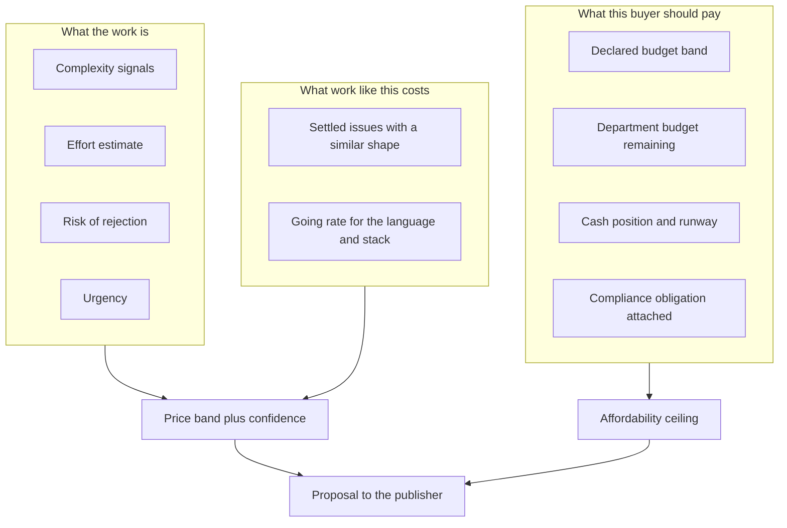
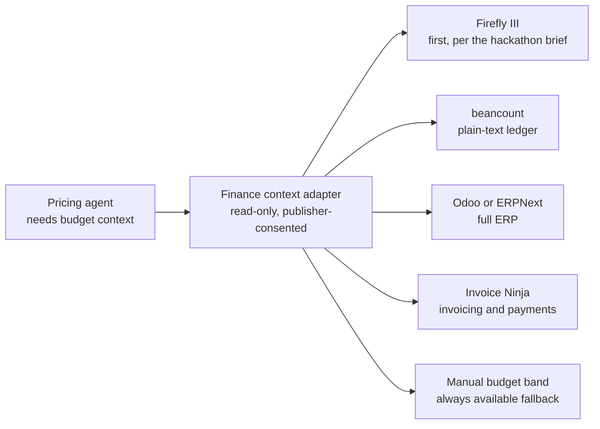

# The pricing engine

There are two pricing problems here and they are easy to confuse.

The first is how we put a price on someone else's issue. That is the product feature our customers judge us on.

The second is how we charge for the platform. That is a straightforward take rate and a subscription, and the industry has already settled what it looks like.

This document covers both, and it is honest about the parts we have not proven.

## How the price is settled

One model, no variants. The price is fixed before the issue is published and it does not move afterwards.

That rules out three things people usually assume a marketplace like this includes. There is no bidding, so contributors do not submit competing prices for the same issue. There is no auction, so the platform never runs a round to discover a clearing price. There is no negotiation, so the publisher sets one number, commits the funds, and the issue is either taken at that number or left alone.

The reason sits in the assignment model described in [05 How it works](./05-how-it-works.md). Work goes to whoever claims the issue first. There is nothing to bid against, because the price is already public and the first claim takes the job.

Removing the bidding round buys two things and costs one.

The publisher learns what the fix costs before committing money, so the budget conversation happens at the moment of decision rather than three days later when the bids close. The contributor knows what they will be paid before starting work, which matters most to whoever has the least runway. Both of those are worth more to us than the price discovery an auction would provide.

What it costs is adaptability. A fixed price cannot absorb a surprise found once work begins, so a badly scoped issue will either sit unclaimed or cost the contributor more than they budgeted. That is why requirement clarity carries weight in the complexity signals below, and why the engine flags an issue whose band rests on a vague description.

This also sidesteps a failure documented in [03 Market research](./03-market-research.md). Selecting on lowest price picks the bidder who spent least time understanding the issue, and the platform pays for that in review time it did not need to spend. Price competition rewards the wrong behaviour when quality cannot be judged before work starts.

## Part one: pricing an issue

### Why this is a product feature and not a formula

Every existing platform asks the buyer to type a number. That is the step where a good intention dies, because most people have no idea what a fix should cost and no way to find out. The buyer either guesses low and gets no submissions, or guesses high and overpays, or gives up.

An agent that proposes a number, shows its work, and lets the buyer adjust removes the hardest part of publishing. It is also the only part of the product that gets better with every issue settled, because the comparables come from our own transaction history.

### The inputs



Task and market inputs set what the work is worth. Buyer inputs set what this specific publisher should be asked, and whether the payment structure should change.

### The complexity signals

We score six things on a scale of one to five and combine them. The weights below are a starting guess and should be tuned against actual settlements.

| Signal | What raises the score | Weight |
| --- | --- | --- |
| Code surface | The change touches many files, or crosses module or package boundaries | 25% |
| Requirement clarity | The issue leaves the expected behaviour ambiguous, or there is no reproduction | 20% |
| Test coverage | No test exists, or the acceptance test has to be written as well as the fix | 15% |
| Dependency depth | The change interacts with a framework, a database, or a protocol | 15% |
| Prior attempts | Earlier pull requests were opened and abandoned or rejected | 15% |
| Blast radius | A security path, a breaking change, or a public interface | 10% |

The score produces an effort estimate in hours, which is the number a buyer can actually reason about.

### The formula, at business level

```
fix price     = hours × rate × complexity multiplier + risk premium + urgency premium
price band    = fix price × 0.7  to  fix price × 1.4
publisher ask = fix price
```

The band is deliberately wide. A single point estimate invites a fight over the exact number. A range invites the buyer to pick a position inside it, which is the behaviour we want.

The rate comes from the going cost of competent work in that technology and region. The low end of the band should be a price at which a talented contributor in a lower-cost market still says yes, because that is where most of the supply will come from.

### Three worked examples

| | Small fix | Medium feature | Compliance-driven remediation |
| --- | --- | --- | --- |
| Issue | Currency rounding off by one cent | Add a plugin system to a CLI | Fix a memory-safety bug reachable from a network parser |
| Complexity score | 1.8 | 3.4 | 4.6 |
| Estimated hours | 3 | 24 | 40 |
| Rate applied | $60 | $90 | $110 |
| Complexity multiplier | 1.0 | 1.3 | 1.6 |
| Risk premium | $0 | $300 | $1,200 |
| Urgency premium | $0 | $0 | $800 |
| Publisher pays | $180 | $3,108 | $9,040 |
| Band shown to the buyer | $126 to $252 | $2,176 to $4,351 | $6,328 to $12,656 |
| Typical outcome | Publishes at the bottom | Publishes near the middle | Publishes near the top, because the alternative is a 2027 filing problem |

The third column is the one that matters commercially. A compliance obligation changes the buyer's willingness to pay far more than any complexity score does, which is why urgency and obligation sit in the model at all.

### The output the publisher sees

Not a number. A short brief:

- The price band, with the recommended point in it.
- Where the effort estimate came from, in plain language.
- The two or three comparable issues that settled recently, with their prices.
- A confidence level, low, medium or high, based on how much comparable history exists.
- A one-paragraph justification the publisher can forward to whoever approves budgets.

That last item is a small feature with an outsized effect. The buyer's hardest step is not knowing the price, it is getting the price approved. Writing the email for them is cheaper than any training data.

### When the buyer cannot afford the work

The engine reads a budget ceiling and can respond three ways, in this order.

1. Re-scope. Split the issue into a fundable first step and a follow-up. This is the best outcome and the hardest to automate well.
2. Change the terms. Same price, later payment, or a milestone split.
3. Say no. Decline to fund, and say what budget would make it possible next quarter.

Publishers will trust a system that tells them no. A system that always finds a way to spend their budget is a system they turn off.

### Anti-gaming

| Attack | Defence |
| --- | --- |
| Publisher understates the issue to get a cheaper price | The engine reads the repository and the issue itself, not the publisher's description of it |
| Contributor inflates effort | Payment is for a merged result, not for time |
| The platform rejects work it should have passed | Every verdict is recorded with its findings, and the contributor can force a re-review against the published criteria |
| Two accounts colluding to farm a payout | The publisher and the contributor must be distinct identities, and payout wallets are screened |
| Publisher merges without accepting to avoid payment | A merge triggers acceptance and releases the payment |

### What is not in the model yet

No reputation-priced component. A contributor with twenty accepted patches in a repository should eventually be able to charge more than a stranger for the same work, and a publisher with a bad payment record should pay more. Both are straightforward once there is transaction history, and neither is worth building before that.

## Part two: the finance integration

This is the part of the design that makes the pricing engine different from a spreadsheet, and it is also the part with the most caveats.

### What we read

| Signal | Why the engine wants it |
| --- | --- |
| Department or category budget remaining | Sets the affordability ceiling |
| Cash position and runway | Changes whether the buyer should pay now or defer |
| Existing vendor and contractor spend | Shows where this payment sits in the pattern |
| Obligation attached to the component | Marks the issue as compliance-driven, which raises the band |

### Firefly III first, and its limits

The Tameion brief points at Firefly III in its prior-art section, noting that it already has a rules engine and has never been connected to money that moves. That is the reason to start there, and it is not a reason to depend on it.

The honest position, drawn from Canteen's own analysis of nine open-source accounting systems:

- Firefly III is a personal finance manager, not an enterprise accounting system. It has no chart of accounts. (Sourced: Canteen, Agents and Ledgers in 2026.)
- Its own documentation refuses programmatic write access, describing automated entry as impossible to do reliably and accurately. (Sourced: same.)
- Rules in Firefly III can delete a journal, which means an agent's rules and a user's rules can fight each other. (Sourced: same.)

So the integration is read-only, and it is a convenience rather than a foundation. An agent that writes to a publisher's books is a liability, and the value we need is on the read side anyway: what is left in the budget and what the cash looks like.

### The adapter we actually want



The correct first deliverable for the hackathon is Firefly III plus the manual band. The adapter shape is what stops this from becoming a rewrite when the first enterprise customer turns up running Odoo.

### What we do not do

We do not post entries to anyone's books. We do not reconcile anyone's bank statements. We do not hold customer funds. The moment we write to a ledger we inherit a class of liability that has nothing to do with our product, and the market research has an entire company's bankruptcy to teach us what happens when a platform holds money it should not.

If the publisher wants the payment recorded in their books, we emit a record they can import. Their accounting system, their control.

## Part three: what we charge

### The take rate

A commission on matched work, in the range of 8 to 12 percent. Comparable platforms sit at ten percent for network marketplaces and at zero for the commission-free entrants, so anything above 15 percent needs a reason.

Our reason is that we do two things a marketplace normally does not: we price the work, and we verify it. That is a defensible reason for a rate at the top of the range, and it stops being defensible the moment a competitor prices for free and matches us on verification.

| | Take rate | Why a buyer accepts it |
| --- | --- | --- |
| Below 8% | Unsustainable | Nothing. We would be subsidising every transaction. |
| 8% | Enterprise | Below our own floor for the tier, and deliberately so: the subscription is what pays for the compliance reporting, so the per-issue rate can be the thinnest on the list |
| 10% | Team | Matches Braintrust and Upwork, so it needs no explanation, and the subscription covers the rest |
| 12% | Open, and the target | We price and verify the work, which neither of them does. This is also the rate the published price floor is derived from |
| Above 15% | Renegotiated | Buyers start routing around us and paying directly |

The tier table in the section below is the single source of truth for these numbers. Every rate quoted anywhere else in this set is one of those three.

The publisher pays the fix price and nothing else. The take rate is charged on that amount rather than added to it, so the price a manager approves is the price on the issue. The escrow carves the rate out on acceptance (`MisthosEscrow.release`), paying the contributor the remainder and the platform's take-rate wallet the fee in the same call, so the rate is a transfer rather than a reporting-layer number. The per-issue rate is set in the contract and bounded there at 15 percent, which is the ceiling above.

### The price floor

Review costs the platform about $6.31 an issue. It is not a line item on the publisher's invoice, so it has to come out of the take rate, and that sets a floor: at the Open tier's 12 percent a fix has to be worth about $52.58 before review pays for itself, so the published minimum is the break-even rounded up to the next $5, which is $55. A thinner take rate needs a higher price: Team's 10 percent breaks even at $63.10 and publishes at $65, and Enterprise's 8 percent breaks even at $78.88 and publishes at $80.

The floor is enforced when an issue is published, per the tier of the publisher asking. Below it the platform declines the work and says why, rather than subsidising it or quietly capping the contributor's pay.

### Tiers

| Tier | Price | Who it is for | What they get | Take rate |
| --- | --- | --- | --- | --- |
| Open | Free | Maintainers and individuals | Per-issue flow, pricing engine, automated review, USDC payout | 12% |
| Team | $249 per month | Companies of 10 to 200 engineers | Everything in Open, plus budget rules, approval thresholds, spend reporting | 10% |
| Enterprise | From $2,000 per month | Companies with a compliance obligation | Everything in Team, plus compliance reporting, audit export, policy-enforced limits, SSO, and a support commitment | 8% |

Prices are anchored against what the buyer already pays for adjacent tools. CodeRabbit charges $30 per developer per month for AI review of pull requests, so a 300-developer company is already spending roughly $9,000 a month on reviewing code. A $2,000 Enterprise tier that also funds the fixes and produces the compliance report is a rounding error next to that number. (Sourced: CodeRabbit pricing page.)

The tier structure is also a wedge against the competitive risk in the market research. Algora has the contributor network and the enterprise conversations. Neither of us has the compliance reporting, and Enterprise is where the durable revenue is.

### Free for maintainers, and why that is not generosity

Maintainers are the supply of well-scoped issues. Charging them would be charging the side of the market that has no budget, and the platform has nothing to sell without their issues. The 12 percent comes off the publisher's side of their transactions.

### Unit economics of a single transaction

| Line | $55 fix (the floor) | $500 fix | $5,000 fix |
| --- | --- | --- | --- |
| Fix price | $55 | $500 | $5,000 |
| Publisher pays | $55 | $500 | $5,000 |
| Platform take at 12% | $6.60 | $60 | $600 |
| Settlement cost, one transfer | $0.01 | $0.01 | $0.01 |
| Agent review cost, 15 minutes at $0.40 | $6.00 | $6.00 | $6.00 |
| Screening, amortised | $0.30 | $0.30 | $0.30 |
| Contribution margin | $0.29 | $53.69 | $593.69 |

The floor column is where the rail matters most. At a 12 percent take there is 29 cents left after review, so anything more than a few cents of settlement cost would wipe the transaction out, and a card fee would make it negative on its own. Above $500 none of this is close to mattering, which is why the floor is the only interesting column.

### Pricing experiments to run

| Experiment | Question | How |
| --- | --- | --- |
| Take rate sensitivity | Does 12% lose deals that 8% would win? | Quote both to the first ten publisher conversations |
| Price band width | Does a wider band increase publishing rates? | Compare 0.7 to 1.4 against a narrower 0.85 to 1.2 |
| Reasoning transparency | Does showing comparables increase approval? | Publish the brief for half the issues, hide it for the other half |
| Tier boundary | Is $249 the right Team price? | Founder-led sales, ask what they currently pay for code review tooling |

## Assumptions that need validating before launch

1. A buyer will accept an agent-generated price without an independent quote. Confidence: medium. Test by comparing our band against what the buyer's own engineer estimates.
2. A maintainer will accept a funded issue they never review, only merge. Confidence: low. If they still want to read every diff themselves, the platform's review saves them nothing and the product is administration software with a payment rail attached.
3. Twelve percent does not push buyers into paying contributors directly. Confidence: medium. The verification is the lock-in, and it needs to be good enough to be worth the rate.
4. Firefly III gives us budget context that is actually useful. Confidence: low. Firefly III is personal finance software and may simply not hold the data an enterprise needs. The manual band fallback exists for this reason.
5. Review can be done for roughly six dollars of agent time. Confidence: medium. Based on a publicly listed agent minute price, not on our own measurements.
