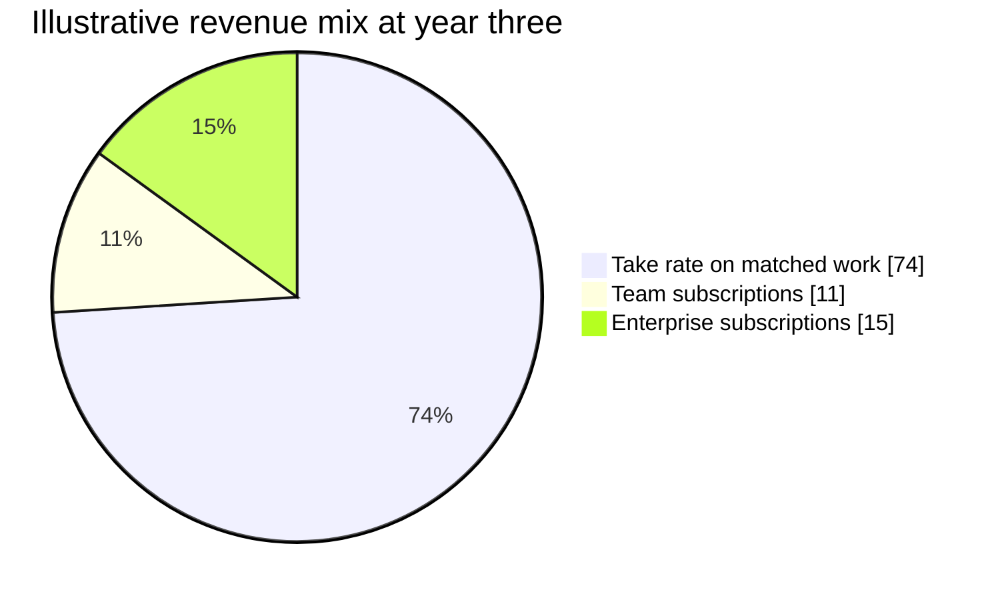

# Business model and economics

## The model on one page

| | |
| --- | --- |
| Problem | Companies depend on open-source code they cannot maintain and cannot pay to fix. Maintainers have a backlog and no budget. |
| Segments | Companies of 50 to 2,000 people shipping software built on open source, and the maintainers of the projects they depend on |
| Unique value proposition | Put a price on a GitHub issue and get it fixed, with the payment settled the moment the work is accepted |
| Solution | Agent-priced issues, escrowed funds, automated review, USDC settlement on Arc |
| Channels | GitHub itself, maintainer communities, open-source programme leads, security and compliance budgets |
| Revenue | Take rate on matched work at 8 to 12 percent, plus organisation subscriptions at $249 and from $2,000 per month |
| Cost structure | Agent inference, engineering salaries, compliance and identity verification, community and content |
| Unfair advantage | The settled-price dataset, which only exists once issues clear on the platform |
| Key metrics | Matched volume, issues settled, reviewer retention, repeat publisher rate |

## The three revenue lines, ranked by how much we believe in them

### Line one: take rate on matched work

The obvious one. A percentage of every settled issue, split between publisher and contributor, in the range of 8 to 12 percent depending on the tier. It scales with volume and costs nothing to sell once the marketplace works.

The problem with relying on it is in the market research. Algora, the best-funded attempt at open-source bounties, has moved its homepage to recruiting. Whatever the take rate on bounties is, it did not carry a company. Treating this as the primary revenue line repeats their experience.

### Line two: organisation subscriptions

Budget rules, approval thresholds, reviewer pools, spend reporting. Sold to the person who owns the open-source programme rather than to the individual manager funding a fix. This is the persona we called Dev, and the reason he buys is that the compliance obligation lands on his desk and not on an engineer's.

Priced at $249 a month for Team and from $2,000 a month for Enterprise, anchored against what a company already spends on adjacent tooling. A 300-engineer company already pays roughly $9,000 a month for AI code review alone at published rates. A compliance reporting line item at $2,000 is easy to justify inside a budget that already exists.

We believe in this line more than the take rate, because it is recurring, it does not depend on marketplace liquidity, and it becomes harder to displace as the regulatory deadline approaches.

### Line three: something we are not building yet

Once thousands of issues have settled, we know what a specific class of work costs in a specific codebase. That is a price index for software work, and nobody has one. It could be sold to insurers, to procurement teams benchmarking vendor quotes, or to platforms that want to price their own jobs.

We are not building it, because a data product from a market you do not yet have is a story rather than a business. It is listed here so the team remembers to keep the data clean and the consent explicit, because the option is worth more than the feature would be today.

## Revenue mix, illustrative

## Illustrative three-year model

Everything in this table is a projection built from the assumptions below it, not a forecast. Do not put these numbers in front of an investor without rebuilding them.

| | Year 1 | Year 2 | Year 3 |
| --- | --- | --- | --- |
| Active publishers | 40 | 250 | 1,200 |
| Issues settled | 400 | 3,000 | 18,000 |
| Average issue price | $700 | $900 | $1,200 |
| Matched volume, GMV | $280,000 | $2,700,000 | $21,600,000 |
| Blended take rate | 12% | 11.7% | 11.1% |
| Take-rate revenue | $33,600 | $315,000 | $2,400,000 |
| Team subscriptions | 8 | 30 | 120 |
| Enterprise subscriptions | 0 | 4 | 20 |
| Subscription revenue | $23,900 | $185,600 | $838,560 |
| Total revenue | $57,500 | $500,600 | $3,238,560 |
| Headcount | 3 | 6 | 12 |
| Net | Negative | Roughly breakeven | Positive |

### What has to be true for year three

1. Average issue price rises from $700 to $1,200, which means buyers move from small fixes toward compliance-driven remediation. That is the whole bet.
2. Twenty enterprises buy the top tier, which is a small number of the thousands of companies with open-source obligations, and a hard one because they buy on a quarterly cycle.
3. Eleven percent blended take rate holds against competitors pricing at zero.
4. Supply keeps up. 18,000 settled issues in a year means roughly 70 a week, which needs several hundred active contributors.

Any one of these failing changes the shape of the business rather than the size of the number.

## Cost structure

| Cost | Year 1 driver | Notes |
| --- | --- | --- |
| Agent inference | About $6 per issue reviewed, at published agent minute pricing | The largest variable cost. Falls with model improvements and rises with review depth. |
| Settlement | About $0.01 per transfer on Arc | Effectively free. This is the reason the product exists on this rail. |
| Engineering | 1 to 2 people | Review quality is the product. This is where the money goes. |
| Identity and sanctions screening | Per verified contributor | Deferred to payout, so the cost lands only on contributors who actually earn |
| Compliance and legal | Money transmission analysis, terms, privacy | See [08 Trust, compliance and risk](./08-trust-compliance-and-risk.md) for why custody is avoided |
| Community and content | Maintainer relationships, conference presence | The supply side does not answer cold email |

The structural choice that keeps the cost base small is not holding customer funds. Escrow lives in a contract on Arc rather than in a Misthos bank account, which removes a money-transmission licensing burden and a class of liability that killed the last company in this category.

## Unit economics

### Per issue settled

| | $40 fix | $500 fix | $5,000 fix |
| --- | --- | --- | --- |
| Platform revenue at 12% | $7.80 | $72.00 | $720.00 |
| Agent review cost | ($6.00) | ($6.00) | ($6.00) |
| Settlement | ($0.01) | ($0.01) | ($0.01) |
| Screening, amortised | ($0.30) | ($0.30) | ($0.30) |
| Contribution | $1.49 | $65.69 | $713.69 |
| Margin | 19% | 91% | 99% |

The small end of the range is the constraint. Below about $50 an issue stops paying for itself, which is why the platform needs a published minimum price rather than discovering one customer at a time.

### Per publisher

| | Team publisher | Enterprise publisher |
| --- | --- | --- |
| Subscription, annual | $2,988 | $24,000 |
| Issues per year | 8 | 40 |
| Average issue price | $650 | $1,800 |
| Matched volume | $5,200 | $72,000 |
| Take-rate contribution | $520 | $5,760 |
| Gross revenue per year | $3,508 | $29,760 |
| Assumed retention | 80% annually | 90% annually |
| Implied lifetime value | About $7,000 | About $100,000 |

### Acquisition cost

Founder-led sales into maintainer communities and open-source programme leads, plus content. There is no paid channel that makes sense at a $3,500 annual contract value, and there is unlikely to be one at $29,760 either, because the buyer population is small enough to reach directly.

Working estimate is $500 to $1,500 of mostly time cost per paying publisher in year one, which puts the payback period inside a year for Team and inside a quarter for Enterprise. Treat that as optimistic, because the whole cost sits on the founding team's calendar and stops being real the moment they stop working weekends.

## What we are not doing with money

No contributor-side acquisition spend. Contributors follow funded issues, and paying to acquire them before there is work to claim wastes the budget.

No paid ads. The buyer is a specific person in a specific role, and they are reachable through the maintainer communities and open-source programme networks that already exist.

No incentive tokens. The market research has a decade of bounty platforms that tried to bootstrap both sides with a token, and none of them are operating today.

## Funding

The hackathon prize is $10,000 at the top end, which is a few months of agent inference and nothing else. The realistic path after the event is a pre-seed round sized for eighteen months of a three-person team, plus enough inference budget to run review on every submission without rationing it.

The Tameion brief commits to follow-on funding and grant support for teams that keep building, and the Enterprise line is the one to raise against, because it is the revenue that does not depend on being right about marketplace liquidity.

## The assumption that decides everything

A mid-sized company will spend $500 to $2,000 on a fix delivered by an unknown contributor, paid over a payment rail it has never heard of.

If that is true, the rest of this model is arithmetic. If it is false, the take-rate revenue line is zero and the business is a code review subscription with an expensive feature attached. Every experiment in the go-to-market plan exists to test that one question, and it should be answered before another line of product code gets written.
