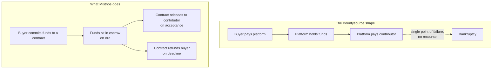
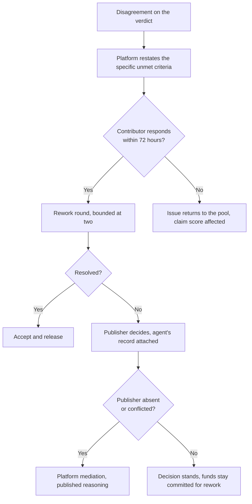

# Trust, compliance and risk

## Trust is the product, not a feature of it

The last company to try this held developers' money, stopped paying verified claims, and filed for bankruptcy. Its users documented tens of thousands of dollars of unpaid bounties. Every remaining platform has organised itself around not making that mistake, in different ways, and none of them have solved the underlying tension: the buyer wants the work verified before paying, the contributor wants the money secured before working, and somebody has to hold it in between.

That somebody is where platforms die.

## Design principle: we do not hold the money

Three consequences follow from the second shape, and they matter more than any feature.

We never touch customer money. This removes a money-transmission licensing burden, a class of liability, and the exact failure mode that ended the last attempt.

Release is programmatic. The contributor can see the funds are committed before starting work. The buyer can see they will come back if nothing arrives.

The rules are visible. A publisher can read the release conditions before funding. Trust in a contract is worth more than trust in a company, because a company can change its mind.

The cost is inflexibility. A dispute about whether work was acceptable is a judgement call, and a contract cannot make one. That is what the dispute path below is for.

## The agent's authority, and where it stops

The Tameion brief frames the design question as: how much autonomy should the agent have? Its own answer is that the limit has to sit somewhere the agent cannot reach. Ours is the same.

| Decision | Who holds it | How the limit is enforced |
| --- | --- | --- |
| Whether to fund an issue at all | Publisher | Human action, no default |
| What the price is | Publisher, on the agent's recommendation | The agent cannot commit funds |
| Whether work is acceptable | The publisher's merge, on the platform's verdict | The agent cannot merge or release |
| Whether to release above a threshold | Publisher's policy | Enforced in the contract, not in a prompt |
| Whether a deadline has passed | Agent | Time-based, no judgement involved |
| What to escalate to a human | Agent | Anything outside a declared budget category |

The distinction that matters is between reversible and irreversible. Choosing which contributors to show, writing a review, and flagging a missed deadline are all reversible and belong to the agent. Committing money and accepting liability for code are not, and belong to a person.

A prompt that says "do not spend more than $500" is a request. A contract that cannot be instructed to spend more than $500 is a limit. We only claim the second one.

## Compliance

### Sanctions and counterparty screening

We need to screen before money moves in either direction. The useful discovery from the market research is that we can inherit most of this rather than build it: Circle's Agent Marketplace continuously screens every seller's payout wallet and drops blocked sellers from the catalogue, and Circle's agent wallets ship with compliance controls built in.

Our own obligations on top of that:

| Obligation | When it applies | Approach |
| --- | --- | --- |
| Sanctions screening of the contributor | First payout, then on a schedule | Provider-backed screening at payout |
| Sanctions screening of the publisher | First funding commitment | Provider-backed, at organisation onboarding |
| Identity verification of contributors | At first payout, never at signup | Progressive. Keeps the first session frictionless. |
| Ongoing re-screening | Continuous while the relationship is active | A single check at onboarding is the mistake the whole industry made |
| Excluded jurisdictions | At onboarding | Declared list, reviewed |

Point-in-time screening is what the market does and it is not good enough, which is exactly what the hackathon's fifth request for builders is about. Continuous screening fits our shape well, because a contributor who gets sanctioned halfway through a claim is a problem we can catch before payout rather than after.

### Who is a software manufacturer

The EU Cyber Resilience Act entered into force on 10 December 2024. Reporting obligations apply from 11 September 2026 and the main obligations from 11 December 2027. (Sourced: European Commission.)

The Linux Foundation's reading of the act, based on the 2022 draft, is that an individual open-source developer is probably excluded unless they regularly charge or take recurring commercial donations, in which case they are likely covered. Nonprofit foundations developing open source will likely need to comply. A private company that develops, commercialises or supports open-source software is very likely covered.

That last category is our buyer, and it is also a category we should be careful about for ourselves. If Misthos charges maintainers for a service, we may be holding ourselves out as supporting open-source software commercially. Whether that makes us a manufacturer under the act is a question for a lawyer, and it is on the list at the end of this document. (Inferred, needs counsel.)

### Tax and reporting

Paying contributors in USDC does not change the tax position of anyone involved. Contributors owe income tax. Publishers may have withholding or reporting obligations depending on jurisdiction and the contributor's status. What we can do is make the record easy: an exportable statement per contributor per year with amounts, dates, issue references, and the counterparty.

Do not understate this. A platform that pays small amounts to many people across many jurisdictions is a reporting problem for its users, and the businesses we want as publishers will not use it if it creates work for their finance team. Producing the record is an Enterprise tier feature and it should be treated as table stakes rather than a nice extra.

### Privacy

Contributors are individuals with wallet addresses, and wallet addresses are pseudonymous rather than anonymous. A public ledger plus a public GitHub handle plus a payout is a linkability problem for anyone who wants one.

The minimum posture: never publish the mapping between a wallet and a GitHub identity, collect identity documents only when required for payout, hold them with a provider rather than in our own storage, and publish a retention period. Publisher spend data is commercially sensitive and should never be visible to contributors beyond the price of the issue they claimed.

The published policy, with its retention periods and how the code enforces it, is in [PRIVACY.md](../PRIVACY.md).

## Dispute resolution

Disputes are rare and expensive, and the policy should be written before the first one rather than after.

Two rules make this cheap. Rework rounds are bounded, because an unbounded review loop costs more than the fix is worth, which is the entire problem we are trying to solve. And the platform's own decisions are published with their reasoning, because a mediation process whose reasoning is secret is indistinguishable from a platform taking the money.

## Risk register

| Risk | Likelihood | Impact | Mitigation | Honest assessment |
| --- | --- | --- | --- | --- |
| Maintainers reject funded issues because of the review burden | High | Severe | Pay for review, filter the queue with an agent | The single biggest product risk. Test first. |
| Buyers will not pay an unknown contributor for a small fix | High | Severe | Small first transactions, escrow, review evidence, refund on failure | The single biggest commercial risk. Also test first. |
| Review agent quality is not good enough to be the only review | High | Severe | Treat review quality as the core engineering problem, measure verdict agreement against human judgement on historical pull requests | The platform is the sole quality gate, so this is the whole product |
| A publisher goes quiet after a passing verdict | Medium | Low | Release to the contributor after seven days | Bounded by the grace period, and it protects the side with less power |
| Nobody claims a funded issue at launch | Medium | High | Seed supply from maintainer communities before opening to publishers | Kills the buyer relationship on first use |
| A platform competitor copies the flow | Medium | Medium | The price dataset and the compliance reporting are not features you can copy in a sprint | Algora could, and the research document says so plainly |
| Custody is forced on us by buyers who want to pay by card | Medium | Medium | Stay out of custody, accept funding by USDC or by a payment partner who holds the licence | Enterprise procurement may push back hard here |
| Regulatory classification of our own role changes | Low | High | Keep custody out of scope, take counsel before launch | Cheap to check, expensive to get wrong |
| A dispute goes public and damages the contributor side | Medium | Medium | Published reasoning, bounded rework, fast payouts | Reputation is the only asset the supply side trusts |
| Agent inference costs rise faster than revenue per issue | Low | Medium | Cache review results, tier the review depth by issue price | Watched, not currently a problem |
| The compliance tailwind slips past 2027 | Low | High | Do not build the whole thesis on the deadline. The take-rate line has to stand alone. | The deadline motivates, it should not be load-bearing |

## SWOT

### Strengths

Agent-first from the start rather than bolted on, so pricing and review are the product rather than features. Settlement on a rail where a cent buys a transaction, which makes small jobs possible for the first time. A regulatory tailwind with a date on it. No custody, which removes the failure mode that killed the previous attempt.

### Weaknesses

No contributor network and no publisher relationships. Review quality is unproven and is the thing everything else depends on. The finance integration runs through tools that were not built for this use case, and Firefly III in particular is personal finance software rather than an enterprise ledger. The team is small, and the two sides of the market both need attention at once.

### Opportunities

The Cyber Resilience Act creates a buyer with a budget and a deadline. Businesses already pay per verified deliverable for security work, so the behaviour exists. x402 is in the Linux Foundation and is at roughly 0.003 percent of stablecoin volume, which leaves the entire market still to be built. The settled-price dataset does not exist anywhere and gets better with every transaction.

### Threats

Algora has the contributor network and the enterprise conversations, and could move into per-issue settlement. Circle could add work matching to its Agent Marketplace, which already has 600+ listed services and inherited compliance screening, and that would put an incumbent with distribution directly on top of us. Maintainers could reject the whole category again. The Free and open source carve-outs in the Cyber Resilience Act could narrow in ways that reduce the obligation we are selling against. A large security or code review vendor could bundle funded fixes into an existing enterprise contract at a price we cannot match.

The Circle threat deserves the most attention. Circle is not a neutral platform in this stack. It owns the chain, the wallets, the marketplace and the compliance screening, and if funded issue fixing turns out to be a real market, it is the natural next product for them. Our defence is that Circle builds infrastructure and does not want to run a review process for a $40 patch, which is a defensible position but not a permanent one. (Inferred.)

## Three things we should do about risk this month

1. Ask five maintainers what they would need to accept a funded issue they never review. If the answer is "I still want to read every diff", the review assumption is wrong and the product needs rethinking.
2. Get one company to commit real money to one real issue, even if it is $50 and the money never moves on a live chain. The first transaction answers more than three months of design.
3. Take a legal opinion on whether platform-mediated payment release is money transmission in our operating jurisdiction, and whether charging maintainers changes our status under the Cyber Resilience Act's manufacturer definition.

## Open questions for counsel

1. Does releasing escrowed funds programmatically make us a money transmitter in the jurisdictions we operate in, given we never hold the funds?
2. Does charging maintainers a fee for a service make us a software manufacturer under the Cyber Resilience Act?
3. What identity verification obligations apply to paying contributors in USDC across borders, and at what threshold?
4. What withholding or reporting obligations attach to the publisher in a cross-border USDC payment to an individual?
5. If a submission contains a third-party contribution, what warranty does the publisher need from the contributor before merging?
