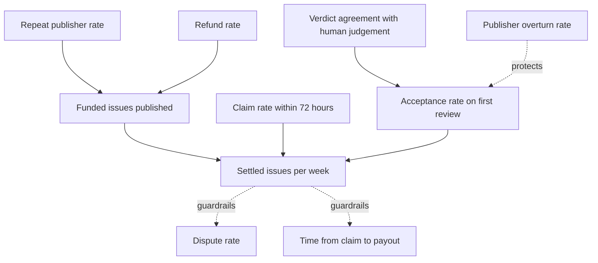
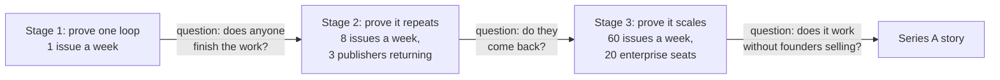

# Metrics and success

## Which game this is

Misthos is a transaction business. Two sides meet, a transaction either happens or does not, and the platform earns when it does. Uber counts weekly trips. Airbnb counts nights booked. Nobody counts dollars at the top, because dollars are the consequence.

There is a productivity dimension underneath, which is that the product removes work from both sides. But the thing we are trying to make happen is the transaction, so that is what we measure.

## The North Star

> **Settled issues per week.**

One issue counts when a pull request merges and the payment releases. Not when an issue is published, not when a contributor claims it, not when a pull request opens. Only the whole loop counts.

Why this one:

| Criterion | How it holds up |
| --- | --- |
| Easy to understand | One issue paid, end to end. Anybody in the company can say whether it went up. |
| Customer-centric | It only moves when a publisher gets code they accept and a contributor gets paid |
| Sustainable value | It implies a repeated habit on both sides rather than a one-off |
| Vision alignment | The vision is that any dependency defect should be fundable, and this is the count of times that happened |
| Quantitative | A countable integer, from a ledger rather than an estimate |
| Actionable | Supply, pricing accuracy, review speed and publisher activation all move it |
| Leading indicator | Growing settled issues precedes subscription revenue by two quarters, because Enterprise buyers start as per-issue users |

### The alternatives we rejected

| Candidate | Why not |
| --- | --- |
| Matched volume in USDC | It is a revenue metric wearing a product costume, and it rewards one $5,000 issue over a hundred $50 ones. Both are wins. |
| Pull requests submitted | Measures effort, not outcome. A platform of rejected submissions looks busy and delivers nothing. |
| Active publishers | Counts intent. A publisher who funded one issue and got nothing still counts. |
| Agent decisions made | The metric a team picks when it has forgotten who the customer is. |

Matched volume belongs in the constellation as a financial companion, and it should never be the number the product team optimises.

## The metrics tree

## Input metrics

### 1. Funded issues published per week

Demand activation. The number of issues a publisher has approved a price for and committed funds against.

Why it matters: if this is flat, nothing downstream can grow. It is the cleanest read on whether the pricing engine is producing numbers publishers will actually sign.

Where it breaks: a publisher can fund twenty issues, get nothing, and stop. That is why the refund rate sits next to it.

### 2. Claim rate within 72 hours

Supply liquidity. The share of funded issues that a contributor claims within three days.

Why it matters: an unclaimed issue is the fastest way to lose a publisher. The maintainer's first experience of the marketplace is whether anyone turns up.

Where it breaks: claims are cheap, so pair this with the acceptance rate or a high claim rate with no submissions looks like squatting.

### 3. Acceptance rate on first review

Quality of matching and of scoping. The share of submissions accepted without a rework round.

Why it matters: low means we are attracting the wrong contributors or writing bad acceptance criteria. Both are fixable and both are fatal if ignored.

Where it breaks: an acceptance rate of 100 percent means the platform is not rejecting anything, which is a different problem.

### 4. Verdict agreement with human judgement

The value proof, and the hardest metric to instrument honestly.

Why it matters: the platform is now the only review. If its verdicts do not match what a competent human would have decided, the product is authorising bad patches, and the maintainers whose acceptance it depends on are the ones who find out.

How to measure: replay the agent against historical pull requests where a human already decided, and compare. Offline and repeatable, which is better than asking anyone to self-report.

Where it breaks: agreement on easy patches is easy. Report it by complexity band, because the metric hides its failures in the aggregate.

### 5. Repeat publisher rate

Retention on the demand side. The share of publishers who fund a second issue within 60 days.

Why it matters: a marketplace where every transaction is a first transaction has no business underneath it. This is the leading indicator for subscription revenue.

Where it breaks: one large publisher can dominate the number, so report the distribution as well as the average.

## Guardrails

These do not drive the business. They stop the North Star from being hit in a way that destroys it.

| Guardrail | Target | What it protects against |
| --- | --- | --- |
| Dispute rate | Under 5 percent of submitted issues | Acceptance becoming contentious |
| Median time from claim to payout | Under 14 days | The promise of fast payment quietly eroding |
| Publisher overturn rate | Under 10 percent | A publisher repeatedly rejecting work the platform passed |
| Refund rate | Under 15 percent | Publishers funding issues nobody completes |
| Share of contributors earning more than $500 in a month | Above 30 percent | A long tail of near-zero earners, which is what kills contributor trust |
| Contributor earnings concentration | Top 10 contributors under 50 percent of payouts | A marketplace that is really a roster of ten people |

That fifth guardrail is the one most platforms get wrong. A contributor who completes two $30 jobs and stops tells every other contributor not to bother.

## The dashboard

| Metric | Source | Hackathon window target | 90-day target | 12-month target |
| --- | --- | --- | --- | --- |
| Settled issues per week | Commitment and payout ledger | 1 | 8 | 60 |
| Funded issues published per week | Issue records | 3 | 15 | 90 |
| Claim rate within 72 hours | Issue lifecycle | 60% | 70% | 80% |
| Acceptance on first review | Review records | Not measured | 40% | 55% |
| Verdict agreement with human judgement | Historical pull requests | Not measured | 80 percent | 90 percent |
| Repeat publisher rate | Publisher records | Not measured | 30% | 50% |
| Matched volume | Settlement ledger | $350 | $6,000 | $60,000 per week |
| Median time to payout | Lifecycle timestamps | Under 7 days | Under 5 days | Under 2 days |
| Dispute rate | Dispute records | Zero | Under 8% | Under 5% |

The hackathon window targets are deliberately, almost embarrassingly small. One settled issue per week is the honest goal for three weeks with one design partner, and the Tameion judging criteria say outright that genuine usage matters more than volume. A single real issue, paid, in a real repository, is worth more than a hundred synthetic ones, and the brief says a synthetic dataset does not count.

## Targets by stage, and what changes at each

The question in each arrow is the only question that matters at that stage. Do not skip ahead. A growth team working on issue 500 has nothing to measure if issues 1 to 10 never settled.

## How we would know the North Star is wrong

If publishers settle issues happily and contributors keep coming back, and the business still does not grow, then the transaction count was the wrong thing to count. The likely reason would be that average issue value is collapsing toward the minimum, which means we built a marketplace for $50 work with the margins of a commodity. Matched volume is the metric that would show it, and it is in the constellation for exactly this reason.

The other failure mode is a high settled-issue count concentrated in one buyer. Recompute the North Star without the largest publisher every quarter and look at what is left.

## What we report to the hackathon judges

The Tameion rubric weights traction at 30 percent and asks specific questions about businesses onboarded and value moved. The honest answers for the submission form are:

- Businesses onboarded: the number of publishers with at least one funded issue, counted individually and named.
- Value moved: total USDC settled, testnet and mainnet reported separately.
- Problems solved: a written account of one specific issue, from the publisher's complaint to the merged pull request, with the price and the payout.
- Agent autonomy: the share of the lifecycle the agent ran without a human action, and the two checkpoints that stayed human.

That last item is the one the judges are actually scoring, since agentic sophistication is weighted at 30 percent alongside traction. A single worked example with a real price, a real review and a real payout demonstrates more than a demo with ten fake repositories.
