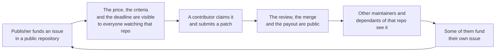
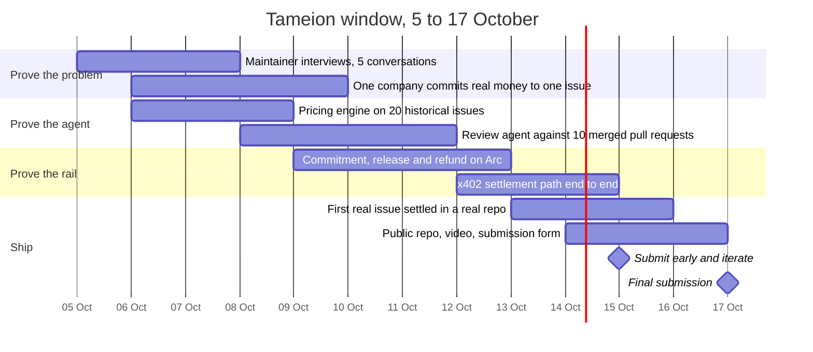
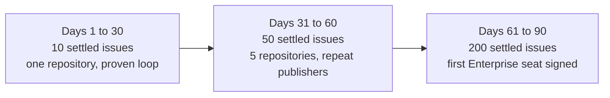

# Go to market and roadmap

## The beachhead

Not "companies that use open source." That is everybody and therefore nobody.

The first segment is a specific project with a specific sponsor: a mid-size open-source library, somewhere between 500 and 20,000 stars, with two or more companies that depend on it commercially and at least one issue that has been open for more than six months.

Why this and not something larger:

- The maintainer already knows which issue matters and already wants it fixed. We do not have to persuade anyone that a problem exists.
- The commercial dependants are identifiable from the repository's own history. They filed the issues, they are in the sponsor lists, they appear in the dependency graph.
- One settled issue in a public repository is seen by exactly the people who might fund the next one. The marketing and the product are the same artifact.
- The ticket sizes are small enough that a single manager can approve them without a procurement cycle, which is the thing that kills every enterprise-first approach at this stage.

The mistake we are avoiding is starting with the enterprise compliance buyer we called Dev. He is the biggest segment eventually and the worst segment first, because his buying cycle is a quarter long and his definition of done involves an auditor.

## Channels, ranked

| Rank | Channel | Why | Effort |
| --- | --- | --- | --- |
| 1 | The funded issue itself, made public in the repository | Reaches maintainers and dependants in the place they already are, with proof attached | Built into the product |
| 2 | Direct outreach to maintainers of target repositories | The supply side is reachable one conversation at a time, and each conversation produces a scoped issue | High, and it is the founder's job |
| 3 | Open-source programme communities | Where the people with a 2027 obligation already gather | Medium |
| 4 | The Canteen and Arc builder communities | Warm, and the audience already believes in the rail | Low |
| 5 | Written explainers on what the Cyber Resilience Act requires from a software company | The buyer's problem, in the buyer's language, and it compounds | Medium |
| 6 | Sponsor and dependency graph mapping | Finds the company that depends on a project, which is the buyer, not the maintainer | Medium |

Channels we are not using: paid search, which does not reach a manager with an unfixed dependency problem. Conference booths, at this budget. Contributor acquisition campaigns, before there is work to claim.

## The loop that has to work

This is a usage loop with a viral edge, and it is the only one worth building at the start. It works because a repository's issue list is a place where the exact right readers already look, and because a payout is more persuasive than a homepage.

The honest weakness is the loop coefficient. One settled issue does not produce one new publisher. It produces attention, and attention converts at a few percent. Early on the loop is below one and we have to seed it by hand, which is what the hackathon plan is for.

### Loops we are not building yet

| Loop | Why not now |
| --- | --- |
| Collaboration | Inviting a teammate into a funded issue is a later feature. There is no team until the Enterprise tier exists. |
| Referral with a cash incentive | Paying contributors to recruit publishers looks like a bounty on signups and attracts the wrong behaviour. |
| User-generated price index | Genuinely useful and impossible before there is transaction history. Keep the data clean and ship it in year two. |

## Messaging by audience

| Audience | Their words | Our line |
| --- | --- | --- |
| Maintainer | "I do not have time to review another drive-by patch" | Fund your backlog and get paid to review it. |
| Engineering manager | "The workaround has been in production for a year" | Put a price on the issue and stop maintaining the workaround. |
| Contributor | "Freelance work means calls and proposals" | A price, an acceptance test, and money in your wallet when it merges. |
| Open-source programme lead | "The 2027 obligation lands on my desk" | Every issue you fund produces an audit-ready record of remediation. |

One line to avoid everywhere: anything that frames the purchase as charity. A sponsor is a donor and donors cut budgets first. The buyer is a customer buying a fix they need, and the language should reflect that.

## The three weeks to the deadline

Today is 5 October. Submissions close on 17 October at 11:59 PM Eastern. There is no live demo day, judging is asynchronous, and we can submit as many times as we like, so the right move is to submit something usable early and keep submitting.

The plan has one non-negotiable item and it is on the second line: one company committing real money to one real issue. Everything else exists to make that transaction work. A working payment rail with no publisher is a demo, and the Tameion brief says outright that a synthetic dataset does not count.

### What we demonstrate

| Judging criterion | Weight | What we show |
| --- | --- | --- |
| Agentic sophistication | 30% | The agent prices an issue and explains why, runs the technical review, and hands a verdict to a human. The two human checkpoints are named and deliberate. |
| Traction | 30% | One named business, one real issue, one real payout. Testnet USDC is acceptable to the judges and should be reported as testnet rather than blurred. |
| Circle tool usage | 20% | Agent wallets for the contributor and the publisher, escrowed commitment on Arc, x402 for settlement, App Kit for any cross-chain move, USYC considered for idle committed funds |
| Innovation | 20% | Pricing work from the buyer's financial position, and an agent's verdict as the settlement condition |

The unused Circle primitives are worth a paragraph in the submission. USYC on committed-but-unreleased funds is a small feature with a real story: money sitting in escrow for three weeks can earn while it waits, which is exactly the Tameion brief's own reading of the Parable of the Talents.

## 90 days after the event

| Phase | Goal | What has to be true to move on |
| --- | --- | --- |
| Days 1 to 30 | Repeat the loop ten times in one repository | The maintainer asks for more, unprompted |
| Days 31 to 60 | Spread to five repositories and get a publisher to fund a second issue | Repeat publisher rate above 30 percent |
| Days 61 to 90 | Sign the first Enterprise seat and publish the compliance report | A buyer with a 2027 obligation will pay for reporting |

## Experiments

Each of these is cheap, and each one can kill an assumption that the whole business rests on.

| # | Question | Method | Success looks like | Cost |
| --- | --- | --- | --- | --- |
| 1 | Will a company pay for a fix delivered by a stranger? | Concierge. Find the issue, get the price agreed, get the fix written, handle the payment manually. | One signed commitment of real money | Founder time |
| 2 | Will a maintainer accept a funded issue they never review, only merge? | Five conversations with maintainers of target repositories | Three of five say yes | Two days |
| 3 | Is the review agent good enough to be the only review? | Run it over ten historical pull requests where a human already decided | 85 percent agreement with the human verdict, and findings a maintainer calls useful | Three days |
| 4 | Is the proposed price plausible to a buyer? | Show ten buyers the band and ask for their own guess before revealing ours | Within 30 percent on seven of ten | Two days |
| 5 | Will a contributor claim a funded issue? | Publish one real funded issue and wait 72 hours | One claim, one pull request | One day |
| 6 | Is finance context actually useful, or is it a feature in search of a problem? | Read Firefly III budgets for two partners and see whether the band changes in a way they agree with | The band changes, and the buyer agrees with the change | Three days |

Experiment 1 matters more than the other five combined. It is also the one most likely to be skipped, because it requires talking to a company and the others only require a keyboard.

## Risks to the launch

| Risk | Response |
| --- | --- |
| No contributor claims the first issue | Line up two contributors by name from the maintainer's existing contributor list before publishing |
| The first payout fails on a technicality | Run the full commitment and release cycle on testnet three days before the first real issue |
| The buyer's finance team blocks a USDC payment | Offer to settle in whatever they can do, and treat the rail as an implementation detail for the first transaction |
| Review quality is visibly worse than a human | Scope the first issues to things with strong existing test coverage, where automated verification is straightforward |
| The maintainer wants to control the pricing | Let them. The engine proposes; the publisher decides. Capture the override as training data. |

## Budget

| Item | Estimate | Notes |
| --- | --- | --- |
| Agent inference for pricing and review | A few hundred dollars for the hackathon window | Based on a publicly listed agent minute price |
| Testnet USDC | Covered by the testnet faucet and the hackathon's TestMint allocation | See the Tameion resources |
| Arc settlement | Cents | Not a budget line |
| Design partner incentive | $350 for the first real issue | Pay it. The first transaction is worth more than the money. |
| Total | Under $1,000 | If we cannot prove the loop for under a thousand dollars, the model has bigger problems than funding |

## How we would know to stop

If, after ten serious conversations, no company will commit real money to a fix, and no maintainer will accept a funded issue, then the thesis is wrong. The response is not to build more product. Either the category needs another five years of the Cyber Resilience Act deadline approaching, or the right business in this space is the compliance reporting layer alone, sold to the buyers who already exist and without the marketplace at all. That fallback is worth naming now, while we still have the option to take it.
